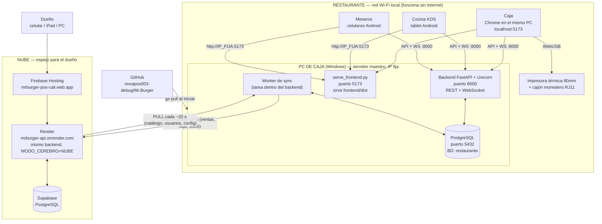
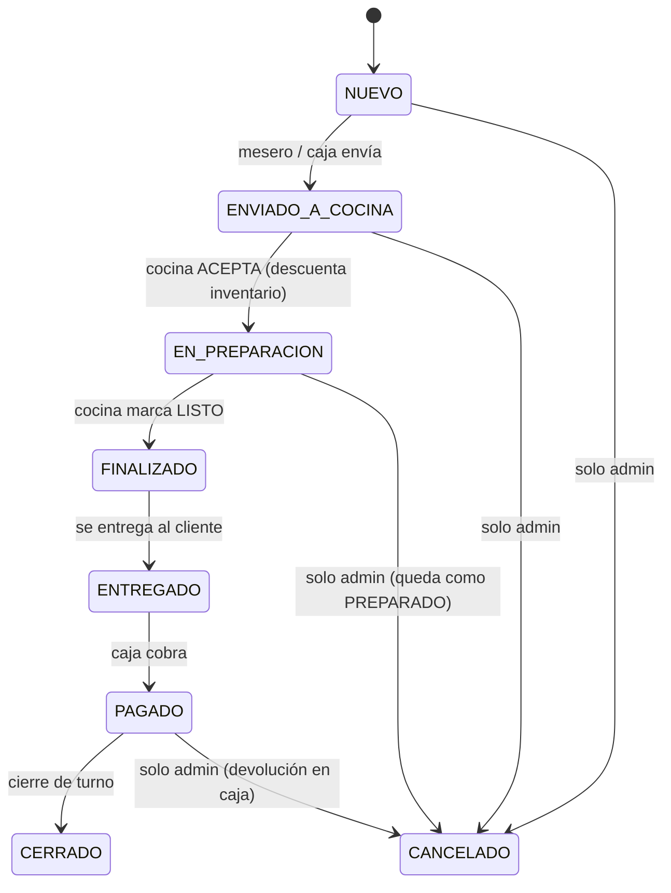
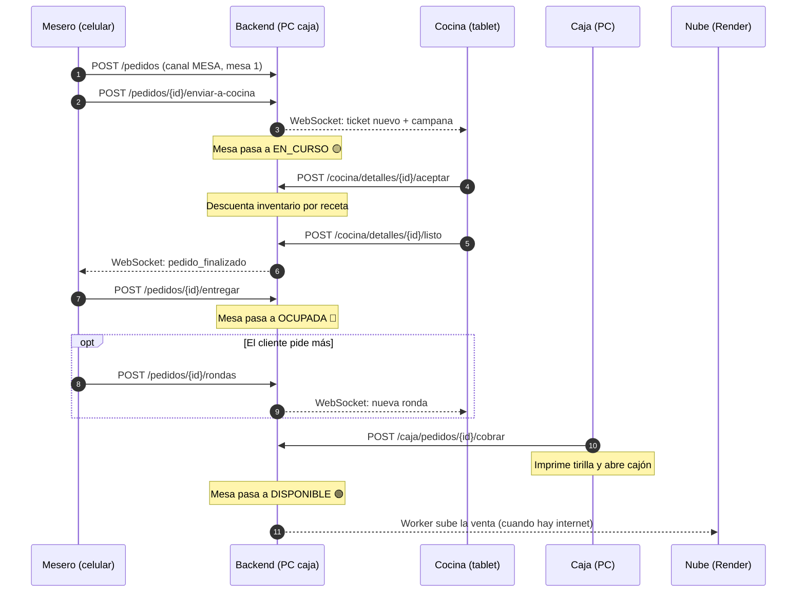
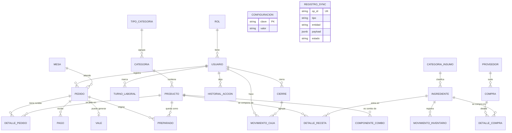
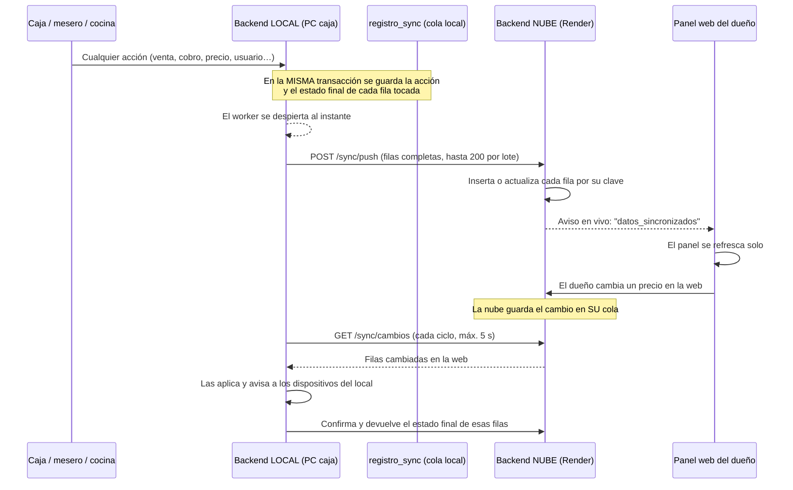
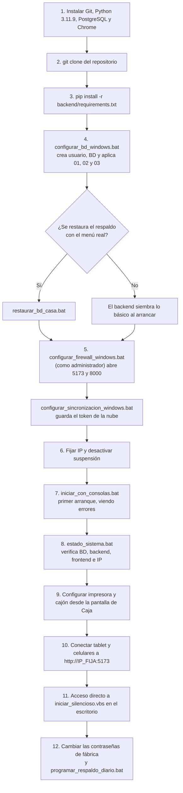

# Mr. Burger POS — Documento de la Verdad

**Fecha de corte:** 10 de octubre de 2026 · **Base:** commit `eafd8ed` + cambios de la rama `fix/auditoria-fases`
**Cliente:** Mr. Burger (Cali) · **Objetivo inmediato:** instalación limpia en el PC de caja del restaurante

Este documento describe **lo que el sistema es y hace hoy según el código**, no según lo que se planeó.
Se construyó leyendo el backend, el frontend, el esquema de base de datos y los scripts de instalación.

**Jerarquía:** si este documento y el `README.md` se contradicen, manda este documento. El README conserva
la idea original y la matriz de recetas, pero tiene partes desactualizadas (ver [sección 14](#14-discrepancias-y-riesgos-detectados)).

**Cómo leer las marcas:**

| Marca | Significado |
|:---:|---|
| ✅ | Verificado leyendo el código o la configuración |
| 📄 | Tomado del README; no lo verifiqué en código |
| ⚠️ | Contradicción, riesgo o punto que hay que decidir |
| ❓ | No se pudo comprobar sin ejecutar el sistema o entrar a la nube |

---

## 0. Estado al 10 de octubre de 2026

Después de dos auditorías se corrigió el sistema en cinco fases. El código está publicado en
`main` y desplegado en Render y Firebase. **Falta el último paso, que solo puede hacerse en el
restaurante:** actualizar el PC de caja y pegarle el token de sincronización.

| Fase | Qué se hizo | Estado |
|:-:|---|---|
| 1 | Nueve errores de operación (cobro anticipado, arqueo, vales, totales, cocina, reinicios) | Corregido y probado |
| 2 | Supabase cerrado: sin permisos públicos y con seguridad por filas en las 25 tablas | **Aplicado en producción** y verificado |
| 3 | Secretos fuera del código: clave de sesiones propia por instalación, token sin valor por defecto, sin contraseñas en el worker | Token nuevo en Render. La nube rechaza las contraseñas que estuvieron publicadas. **Falta** que el dueño cambie las suyas en la caja |
| 4 | Sincronización por filas en ambos sentidos y panel de administración en vivo | Corregido y probado |
| 5 | Segunda auditoría: merma de plato, rondas duplicadas por Wi-Fi, comandas offline rechazadas en silencio, kardex de compras, archivo automático de la nube, arranque de un clic e impresión sin diálogo | Corregido y probado |

Qué pasó con cada riesgo de la [sección 14](#14-discrepancias-y-riesgos-detectados):

| Riesgo | Situación |
|---|---|
| 14.1 Secretos en repositorio público | Código limpio. Pendiente: rotar token y contraseñas, y volver privado el repositorio (el historial conserva los valores viejos). El respaldo SQL sigue en el repositorio. |
| 14.2 Respaldos dependen de Docker | Nuevos `respaldar_bd_windows.bat` y `programar_respaldo_diario.bat` para PostgreSQL nativo. **Sin probar**: en el PC de desarrollo no hay PostgreSQL nativo. |
| 14.3 Versión de PostgreSQL | Sin cambio. Sigue la recomendación: instalar la 18. |
| 14.4 Auto-actualización en cada arranque | Sin cambio. Decisión pendiente. |
| 14.5 Los `.bat` ignoran `.env` | Ya no fijan `SECRET_KEY`. Siguen fijando la base local, a propósito. |
| 14.6 Descuento de inventario | Aclarado: descuenta cocina al aceptar; la caja solo descuenta lo que nunca pasó por cocina. Nunca dos veces (probado). |
| 14.7 Turno laboral automático | Sin cambio. Decisión pendiente. |
| 14.8 Migraciones SQL | El esquema base ya incluye los valores nuevos; el backend corrige las bases existentes al arrancar. |
| 14.9 Sincronización por id | Resuelto con rangos de numeración separados. |
| 14.10 Documentación desactualizada | Scripts de Termux y de la sincronización vieja eliminados. El `README.md` sigue sin actualizar. |

### Datos que hay que revisar con el dueño

Encontrados al analizar el respaldo; **no se modificaron** porque son decisiones del negocio.

| Dato | Problema |
|---|---|
| Insumo "Porcion Ensalda" | Costo de $1.000 por gramo. Hace que *Costilla St. Louis* y *Asado Baby* muestren costo de ~$73.000 y margen negativo. |
| 11 bebidas | No tienen receta: venderlas no descuenta inventario (gaseosas, agua, cerveza, jugos). |
| Salsa Mr Burger, Chimichurry, Salsa de Tomate, Alitas, gaseosas, agua | Costo en $0: los márgenes de casi todo el menú salen inflados. |
| 7 insumos con stock negativo | Carne de res, Baby Beef, Tomate, Lechuga Batavia, Queso Americano, Salsa BBQ, Aceite. Hay que hacer un conteo inicial. |
| 16 insumos de receta sin usar | Pulpas, Leche, Mayonesa, Arepas, Pan Brillo, etc. O faltan en recetas o sobran. |
| "Porta Perro" | Duplicado de "P1 (Porta Perro Caliente)". |
| Chuzo de Pollo, Chuzo Mixto, Alitas Miel Mostaza | Sin empaque para llevar asignado. |
| Insumos "Salsa Picante" y "Porcion Ensalda" | Sin categoría. |
| Empaque C1 | Precio de venta $400 en el respaldo, pero $1.500 en la configuración general. |

---

## Índice

0. [Estado al 10 de octubre de 2026](#0-estado-al-10-de-octubre-de-2026)
1. [Qué es el sistema](#1-qué-es-el-sistema)
2. [Arquitectura](#2-arquitectura)
3. [Tecnología y versiones](#3-tecnología-y-versiones)
4. [Roles, pantallas y dispositivos](#4-roles-pantallas-y-dispositivos)
5. [Canales de venta y estados](#5-canales-de-venta-y-estados)
6. [Reglas de negocio](#6-reglas-de-negocio)
7. [Flujos principales](#7-flujos-principales)
8. [Modelo de datos](#8-modelo-de-datos)
9. [API del backend](#9-api-del-backend)
10. [Tiempo real (WebSocket)](#10-tiempo-real-websocket)
11. [Sincronización local ↔ nube](#11-sincronización-local--nube)
12. [Servicios en la nube](#12-servicios-en-la-nube)
13. [Instalación objetivo en el PC del restaurante](#13-instalación-objetivo-en-el-pc-del-restaurante)
14. [Discrepancias y riesgos detectados](#14-discrepancias-y-riesgos-detectados)
15. [Decisiones pendientes](#15-decisiones-pendientes)
16. [Checklist de aceptación](#16-checklist-de-aceptación)

---

## 1. Qué es el sistema

POS completo para un restaurante de comida rápida. Lema del proyecto: *"Simple por fuera. Inteligente por dentro."*

- El **mesero** toma el pedido en el celular.
- La **cocina** lo recibe al instante en una tablet, con campana y temporizador.
- La **caja** cobra, imprime la tirilla y abre el cajón.
- El **inventario** se descuenta solo, por receta.
- El **dueño** ve el negocio desde cualquier lugar por la web.

Principio rector: **el restaurante nunca se detiene por falta de internet**. Todo lo operativo ocurre dentro del
local; la nube es un espejo para el dueño.

---

## 2. Arquitectura

**Puntos clave ✅**

- **Un solo código de backend** corre en dos lugares. La variable `MODO_CEREBRO` decide el papel:
  `LOCAL` (PC de caja, envía y descarga) o `NUBE` (Render, solo recibe).
- **Un solo frontend** (PWA) sirve a todos los roles. Decide solo a qué backend hablar según la dirección desde
  la que se abrió (`frontend/src/api/client.ts`):

| Se abre desde | API que usa |
|---|---|
| `*.web.app`, `*.firebaseapp.com`, `*.onrender.com` o cualquier HTTPS público | `https://mrburger-api.onrender.com/api` |
| `localhost` / `127.0.0.1` | `http://localhost:8000/api` |
| Una IP de LAN (ej. `192.168.1.150:5173`) | `http://<esa misma IP>:8000/api` |
| IP guardada manualmente en el dispositivo (`pos_server_ip`) | Esa IP, puerto 8000 |

  Por eso meseros y cocina **no configuran nada**: abren la IP del PC y funciona.
- El frontend **ya viaja compilado dentro del repositorio** (`frontend/dist`, 48 archivos versionados). El PC del
  restaurante **no necesita Node.js**; lo sirve un script de Python.

---

## 3. Tecnología y versiones

| Capa | Tecnología | Versión | Fuente |
|---|---|---|---|
| Backend | Python | 3.11.9 | `.python-version` |
| | FastAPI / Uvicorn | 0.115.6 / 0.34.0 | `backend/requirements.txt` |
| | SQLAlchemy / psycopg2 | 2.0.36 / 2.9.10 | idem |
| | Auth | JWT (`python-jose`) + bcrypt (`passlib`) | idem |
| | Cliente HTTP del worker | httpx 0.28.1 | idem |
| Base de datos | PostgreSQL | ⚠️ ver [14.3](#143-versión-de-postgresql) | — |
| Frontend | React / React Router | 19 / 7 | `frontend/package.json` |
| | Vite / TypeScript / Tailwind | 8 / 6 / 4 | idem |
| | PWA | `vite-plugin-pwa` (autoUpdate, skipWaiting) | `vite.config.ts` |
| Zona horaria | `America/Bogota` | — | `config.py`, `core/tiempo.py` |

**Puertos ✅**

| Servicio | Puerto | Quién lo usa |
|---|:---:|---|
| Frontend (PWA) | 5173 | Todos los dispositivos |
| Backend REST + WebSocket | 8000 | Todos los dispositivos |
| PostgreSQL | 5432 (cae a 5433 si 5432 está cerrado) | Solo el backend, en el mismo PC |

---

## 4. Roles, pantallas y dispositivos

| Rol | Ruta | Puede entrar | Dispositivo | Ve dinero |
|---|---|---|---|:---:|
| Mesero | `/mesero` | mesero, admin | Celular Android | No |
| Cocina | `/cocina` | cocina, admin | Tablet Android | No |
| Caja | `/caja` | cajero, admin | PC de caja | Sí (su turno) |
| Admin | `/admin` | admin | Cualquiera | Todo |
| — | `/login` | público | — | — |

Cualquier otra ruta redirige a `/login`. ✅ (`frontend/src/App.tsx`)

**Pestañas del panel Admin ✅:** Dashboard · Planilla · Inventario · Recetas · Compras · Preparados · Usuarios ·
Asistencia · Configuración · Auditoría.

**Usuarios que crea la instalación base ✅** (`01_schema.sql`): `admin`, `caja`, `mesero`, `cocina`. Los tres
últimos son cuentas **demo**: lo que hagan queda marcado `es_demo` y se puede borrar sin tocar ventas reales.
Sus contraseñas son las de fábrica y **son públicas** (ver [14.1](#141-seguridad-el-repositorio-es-público-y-contiene-secretos)).

**Mesas:** 9, numeradas 1 a 9. ✅

---

## 5. Canales de venta y estados

**Canales ✅** (restricción en la base de datos): `MESA`, `MOSTRADOR`, `DOMICILIO`, `DIDI`.

**Tipo de consumo ✅:** `LOCAL` (comer aquí) o `LLEVAR`. En `LLEVAR` se suma el empaque al total.

**Métodos de pago ✅:** `EFECTIVO`, `TARJETA`, `TRANSFERENCIA`, `VALE`, `DIDI_TARJETA`, `DIDI_EFECTIVO`.

### Estados del pedido

| Entidad | Estados ✅ |
|---|---|
| Línea de pedido (ronda) | `ENVIADO → PREPARANDO → LISTO → ENTREGADO` (+ `CANCELADO`) |
| Mesa | `DISPONIBLE` 🟢 · `EN_CURSO` 🟡 · `OCUPADA` 🔴 |
| Pago | `VALIDO` · `DEVUELTO` |
| Vale | `PENDIENTE` · `COBRADO` · `ANULADO` (la venta se devolvió o canceló) |
| Preparado | `DISPONIBLE` · `ASIGNADO` · `DESCARTADO` |
| Movimiento de caja | tipo `ENTRADA` / `SALIDA` |
| Movimiento de inventario | `VENTA`, `COMPRA`, `MERMA`, `AJUSTE`, `DEVOLUCION`, `DESPERDICIO` |

**Categorías de movimiento de caja ✅:** `PAGO_TURNO`, `PRESTAMO`, `ADELANTO`, `PROVEEDOR`, `DEVOLUCION`,
`COBRO_VALE`, `CAMBIO_INICIAL`, `GASTO_OPERATIVO`, `OTRO`.

---

## 6. Reglas de negocio

| # | Regla | Estado |
|:-:|---|:---:|
| 1 | **Nada se borra.** Cancelar es un evento con motivo y reversa; el historial es la ley. | 📄 |
| 2 | **Solo el admin cancela** un pedido (`POST /pedidos/{id}/cancelar`). La caja solo devuelve el dinero. | ✅ |
| 3 | **El inventario sigue la producción, no la plata.** Se descuenta cuando cocina acepta. | ⚠️ [14.6](#146-momento-exacto-del-descuento-de-inventario) |
| 4 | Pedido producido y cancelado → su comida pasa a **Preparados** para revenderse sin volver a descontar. | 📄 |
| 5 | Un preparado solo lo toma un mesero: al asignarse queda reservado en la misma transacción. | 📄 |
| 6 | **Vale (pagaré):** nombre, cédula, teléfono, monto. Lo cobran admin y caja. | ✅ |
| 7 | **Entradas y salidas de caja** exigen descripción. | 📄 |
| 8 | **DiDi tarjeta** no es efectivo: queda "por cobrar a DiDi". **DiDi efectivo** sí entra a la gaveta. | 📄 |
| 9 | **Impuesto:** `iva_porcentaje = 0` por defecto (Régimen No Responsable, Art. 512-13 E.T.), con leyenda legal en la tirilla. Configurable. | ✅ |
| 10 | **Mesero y cocina no ven dinero**, costos ni márgenes. | 📄 |
| 11 | **Stock insuficiente:** política `ADVERTIR_Y_PERMITIR`. Se muestra "Sin stock" pero **se permite vender**. El backend la fuerza en cada arranque. | ✅ |
| 12 | **Empaques para llevar:** los insumos marcados `solo_llevar` en la receta (C1, P1, bolsas) solo se descuentan y cobran si el pedido es `LLEVAR`. | ✅ |
| 13 | **Insumo vs gasto operativo:** aseo y papelería son `GASTO_OPERATIVO` y no pueden ir en recetas. | 📄 |
| 14 | **Cuentas fijadas** (`fijado`): ningún reinicio del sistema puede borrarlas. | ✅ |
| 15 | **Cuentas demo** (`es_demo`): todo lo que generan se etiqueta solo y se puede purgar aparte. | ✅ |
| 16 | **Temporizador de cocina:** 28 minutos, configurable (`minutos_cocina`). | ✅ |
| 17 | **Consecutivo de pedido** se reinicia cada día según la hora de Cali, no UTC. | ✅ |

### Tabla definitiva de cancelación 📄

| Momento | ¿Devuelve dinero? | Inventario |
|---|:---:|---|
| No pagado + no producido | No | No se descuenta |
| No pagado + producido | No | Queda descontado |
| Pagado + no producido | Sí, en caja | No se descuenta |
| Pagado + producido | Sí, en caja | Queda descontado |

### Configuración que vive en la base de datos ✅

`nombre_local`, `iva_porcentaje`, `minutos_cocina`, `modo_impuestos`, `didi_comision_pct`,
`politica_stock_insuficiente`, `leyenda_tributaria`, `sku_empaque_llevar`, `precio_empaque_llevar`.

---

## 7. Flujos principales

### 7.1 Pedido en mesa, de punta a punta

### 7.2 Otros flujos

| Flujo | Resumen |
|---|---|
| **Mostrador** | La caja crea el pedido, cobra por adelantado, cocina prepara, se entrega con ticket. |
| **Domicilio** | Nombre, teléfono y dirección; empaque automático; pago al recibir o ya pagado. |
| **DiDi** | Llega por la app de DiDi; la caja lo registra con canal `DIDI` y número de orden obligatorio. Cocina lo ve en naranja. |
| **Cambio de consumo** | `PATCH /pedidos/{id}/tipo-consumo` permite pasar de local a llevar justo antes de cobrar; recalcula el total. |
| **Merma** | `POST /ingredientes/merma` registra pérdida de insumo (accesible a caja y admin). |
| **Compra a proveedor** | `POST /admin/compras` sube el stock y calcula IVA 19% de la factura. |
| **Apertura de turno** | La caja ingresa la base en efectivo; se guarda como `CAMBIO_INICIAL`. |
| **Cierre de turno** | Arqueo ciego por denominaciones → Reporte Z → fotograma inmutable en `cierre`. |
| **Puesta en blanco** | `POST /admin/sistema/reset`, granular y con contraseña del admin. Respeta cuentas fijadas. |

---

## 8. Modelo de datos

**25 tablas ✅** (definidas en `database/init/01_schema.sql` y reflejadas en `backend/app/models/`).

| Grupo | Tablas |
|---|---|
| Seguridad | `rol`, `usuario`, `turno_laboral`, `historial_accion` |
| Catálogo | `tipo_categoria`, `categoria`, `producto`, `componente_combo` |
| Inventario | `categoria_insumo`, `ingrediente`, `detalle_receta`, `movimiento_inventario` |
| Compras | `proveedor`, `compra`, `detalle_compra` |
| Operación | `mesa`, `pedido`, `detalle_pedido`, `preparado` |
| Dinero | `pago`, `vale`, `movimiento_caja`, `cierre` |
| Sistema | `configuracion`, `registro_sync` |

**Categorías del menú real ✅** (según el respaldo): Hamburguesas · Combos · Perros Calientes · Asados ·
Mazorcas y Desgranados · Alitas · Para Compartir y Adiciones · Bebidas · Otros Servicios.

**Volumen del respaldo `database/backup_restaurante_completo.sql`** (aproximado, por conteo de líneas):
unos 69 productos, 90 insumos, 320 líneas de receta, 7 usuarios y 3 pedidos.

### Cómo se construye el esquema ✅

Hay **tres mecanismos superpuestos**, y eso importa para instalar bien:

1. **Archivos SQL** en `database/init/`: `01_schema`, `02_seeds`, `03_migracion_arquitectura_e_insumos`,
   y dos archivos con prefijo `04_` (`empaques_gastos` y `es_demo_y_columnas`).
2. **Auto-migración al arrancar el backend** (`main.py`, función `lifespan`): crea tablas faltantes, agrega
   columnas con `ADD COLUMN IF NOT EXISTS`, asegura bolsas T20–T40, precios de empaques y la política de stock.
3. **Migraciones de una sola vez** (`services/migraciones.py`): marcas demo/fijado y empaques por defecto.
   Usan la tabla `configuracion` como bandera para no repetirse.

La matriz completa de recetas y gramajes está en el `README.md`, sección 21.2, y precargada en
`backend/app/services/seed_recetas.py`.

---

## 9. API del backend

Todas las rutas existen **dos veces**: con y sin el prefijo `/api` (ej. `/pedidos` y `/api/pedidos`). ✅

**Permisos ✅** (`backend/app/core/deps.py`):

| Dependencia | Roles admitidos |
|---|---|
| `admin_required` | admin |
| `cashier_required` | admin, cajero |
| `kitchen_required` | admin, cocina |
| `staff_required` | admin, cajero, mesero, cocina |
| `sync_token_required` | Solo el token de sync en la cabecera `X-Sync-Token` |
| `sync_or_staff_required` | Token de sync, o cualquier usuario activo (solo para consultar estado) |

| Módulo | Prefijo | Endpoints |
|---|---|---|
| **Auth** | `/auth` | `POST /login` · `GET /me` · `PUT /cambiar-password` |
| **Categorías** | `/categorias` | `GET /` · `GET /tipos` · `POST /` · `PUT /{id}` · `DELETE /{id}` |
| **Productos** | `/productos` | `GET /` · `GET /{id}` · `POST /` · `PUT /{id}` · `DELETE /{id}` · `PUT /{id}/disponibilidad` · `GET`/`PUT /adiciones/configuracion` |
| **Inventario** | `/ingredientes` | `GET`/`POST /` · `PUT`/`DELETE /{id}` · `GET /{id}/movimientos` · `GET`/`POST /categorias` · `GET`/`PUT /productos/{id}/receta` · `GET /productos/{id}/costo-utilidad` · `GET`/`PUT /combos/{id}/componentes` · `POST /merma` |
| **Pedidos** | `/pedidos` | `GET`/`POST /` · `GET /{id}` · `GET /mesas` · `PUT /mesas/{id}/estado` · `POST /{id}/enviar-a-cocina` · `POST /{id}/rondas` · `PATCH /{id}/tipo-consumo` · `POST /{id}/entregar` · `POST /{id}/cancelar` |
| **Cocina** | `/cocina` | `GET /cola` · `POST /detalles/{id}/aceptar` · `POST /detalles/{id}/listo` · `POST /detalles/{id}/cancelar` |
| **Caja** | `/caja` | `POST /pedidos/{id}/cobrar` · `GET /pedidos/{id}/pagos` · `POST /pagos/{id}/devolver` · `GET /vales` · `POST /vales/{id}/cobrar` · `GET`/`POST /movimientos` · `GET /turno` · `POST /turno/abrir` · `POST /turno/cerrar` · `GET /cierres` · `GET /cierres/{id}` · `POST /abrir-cajon` |
| **Preparados** | `/preparados` | `GET /` · `GET /sugerir` · `POST /{id}/asignar` · `POST /{id}/descartar` |
| **Admin** | `/admin` | `GET /dashboard` · `GET /reportes/ventas` · `GET /stock-critico` · `GET /auditoria` · `GET`/`POST /compras` · `GET /configuracion` · `PUT /configuracion/{clave}` · `GET`/`POST /usuarios` · `PUT /usuarios/{id}/password` · `PUT /usuarios/{id}/estado` · `PUT /usuarios/{id}/marcas` · `GET /sistema/reset/resumen` · `POST /sistema/reset` |
| **Asistencia** | `/asistencia` | `POST /entrada` · `POST /salida` · `GET /mi-turno` · `GET /admin/activos` · `GET /admin/historial` · `POST /admin/{id}/cerrar` · `POST /admin/cerrar-todos` |
| **Sync** | `/sync` | `GET /health` (sin autenticación) · `POST /push` · `GET /cambios` · `POST /confirmar` · `POST /reiniciar-espejo` (solo con token de sync) · `GET /estado` · `POST /forzar` · `GET /pull` (diagnóstico, admin) |
| **Sistema** | — | `GET /` · `GET /health` · `GET /api/health` · `WS /ws/pedidos` |

**Sesión ✅:** el token JWT dura 720 minutos (12 horas). El frontend lo guarda en `localStorage` como
`pos_token` y, si recibe un 401, limpia la sesión y vuelve a `/login`.

---

## 10. Tiempo real (WebSocket)

- Un solo canal: `ws://<servidor>:8000/ws/pedidos?token=<jwt>`. Sin token válido se rechaza. ✅
- El servidor **difunde cada evento a todos** los conectados, en paralelo y con límite de 2,5 s por
  dispositivo, para que un celular con mala señal no frene a la cocina. ✅
- El cliente envía `ping` y recibe `pong` para mantener viva la conexión. ✅

| Evento | Quién lo dispara |
|---|---|
| `detalle_aceptado`, `detalle_listo`, `detalle_cancelado`, `pedido_finalizado` | Cocina |
| `pedido_pagado` | Caja |
| `preparado_asignado`, `preparado_descartado` | Preparados |
| `catalogo_actualizado` | Admin cambia productos/recetas, o llega un cambio de la nube |
| `inventario_actualizado` | Mermas y ajustes |
| `cierre_turno_forzado`, `cierre_caja_general` | Admin cierra turnos |
| `datos_sincronizados` | Llegaron datos del otro lado (incluye la lista de tablas). El panel de administración se refresca al recibirlo |

---

## 11. Sincronización local ↔ nube

> Rediseñada el 10 de octubre de 2026. Código: `backend/app/core/replicacion.py`,
> `backend/app/services/sync.py`, `backend/app/services/sync_worker.py`.

**Idea central:** en vez de mensajes escritos a mano por cada tipo de operación, **cada fila que se
guarda en la base de datos se replica completa** al otro lado, tal como quedó. Lo que se guarda, sube;
lo que se cambia en la web, baja. No hay listas de "qué se sincroniza" que mantener.

### Reglas

| Tema | Cómo funciona |
|---|---|
| **Qué se replica** | Las 24 tablas de negocio, en ambos sentidos. Solo se excluyen la propia cola (`registro_sync`) y las claves internas de `configuracion` (prefijos `sync_` y `migracion_`). |
| **Tiempo real** | Cada cambio confirmado despierta al worker; no espera el temporizador. Medido en pruebas: una venta aparece en la nube en **0,1 a 2 s** y un cambio hecho en la web llega a la caja en **menos de 1 s** (con conexión). |
| **Sin internet** | La caja sigue trabajando. La cola crece y se entrega sola al volver la conexión, conservando la hora real de cada venta. |
| **Identificadores** | La caja numera desde 1; **la nube numera desde 1.000.000**. Lo creado en el panel web nunca choca con lo creado en la caja. |
| **Stock** | Lo manda la caja. De la web solo bajan los *movimientos* (compra, ajuste, merma) y se suman como diferencia; el número de stock de la web nunca pisa el de la caja. |
| **Conflictos** | Gana el último cambio que llega. Después de aplicar un cambio de la web, la caja devuelve el estado resultante para que ambos lados queden idénticos. |
| **Sin duplicados** | Cada operación tiene un `op_id` único; reenviarla no la aplica dos veces. |
| **Reintentos** | Una fila rechazada se reintenta con espera creciente (hasta ~3 horas, 20 intentos) y luego se aparta como `ERROR_SERVIDOR`. Un reintento tardío nunca pisa un dato más nuevo. |
| **Una sola caja por nube** | La primera caja que sube queda vinculada al espejo. Cualquier otra instalación es rechazada (protege de un PC de pruebas apuntando a producción). |
| **Espejo exacto** | Al vincularse por primera vez, la nube recibe la copia completa de esa caja. Lo que tuviera antes **no se borra**: se guarda en el esquema `archivo` (tablas `<tabla>__<fecha>`). |
| **Versiones viejas** | Un envío de una caja con la versión anterior se registra sin aplicar y no vincula nada. |

### Seguridad del canal

- `/sync/push`, `/sync/cambios`, `/sync/confirmar` y `/sync/reiniciar-espejo` exigen el **token de
  sincronización** (`X-Sync-Token`). Una sesión de usuario, aunque sea de administrador, no puede usarlos.
- El token no tiene valor por defecto en el código. Si `CLOUD_SYNC_TOKEN` está vacío, no se sincroniza.
- El worker ya **no inicia sesión como administrador** en la nube: no hay contraseñas en el código.

### Límites conocidos

- **Las ventas se hacen en el restaurante.** El panel web es para administrar (catálogo, precios,
  usuarios, compras, ajustes, movimientos de caja, reportes). Vender desde la web al mismo tiempo que en
  el local no está contemplado: los consecutivos y el turno de caja podrían chocar.
- **"Puesta en blanco" se ejecuta en la caja**, no en la web (el borrado masivo de stock no viaja como movimiento).
- **Reinstalar la caja con una base nueva** exige reiniciar el espejo (`python scripts/reiniciar_espejo.py`).
  El historial de la nube pasa al esquema `archivo`, pero deja de verse en el panel. Antes de reinstalar hay que restaurar el último respaldo local.
  Restaurar la caja *desde* la nube no existe todavía.
- Las pestañas Inventario, Usuarios, Asistencia y Configuración del panel no se refrescan solas; el
  Dashboard, Compras, Preparados y Auditoría sí.

### Cómo se verificó

Dos suites automáticas en `pruebas/`, que levantan una caja y una nube reales con bases desechables:

| Suite | Qué cubre | Resultado |
|---|---|:---:|
| `prueba_operacion.py` | Cobro, arqueo, vales, cancelaciones, cocina, preparados, mermas, rondas, compras, reinicios | 41 de 41 |
| `prueba_sincronizacion.py` | Copia inicial, venta completa, cancelación, corte de internet, cambios desde la web, protecciones, aviso en vivo, reinicio y archivo del espejo | 48 de 48 |

Ambas pasan sobre la copia del respaldo y sobre una base creada con los scripts de instalación.
**No se ha probado todavía contra Render y Supabase reales**: eso ocurre al desplegar.

---

## 12. Servicios en la nube

| Servicio | Qué aloja | Identificador | Cómo se despliega |
|---|---|---|---|
| **GitHub** | Código fuente | `novapos003-debug/Mr.Burger`, rama `main` | `git push` |
| **Firebase Hosting** | Frontend del dueño | Proyecto `mrburger-pos-cali` → `https://mrburger-pos-cali.web.app` | `npm run build` + `firebase deploy` |
| **Render** | Backend en modo `NUBE` | `https://mrburger-api.onrender.com` | ❓ presumiblemente automático desde `main` |
| **Supabase** | PostgreSQL de la nube | ❓ referencia de proyecto no visible en el repo | — |

**Variables que el backend lee ✅** (`backend/app/config.py`): `DATABASE_URL`, `SECRET_KEY`, `ENTORNO`,
`ACCESS_TOKEN_EXPIRE_MINUTES`, `ZONA_HORARIA`, `MODO_CEREBRO`, `SUCURSAL_ID`, `CLOUD_SYNC_ENABLED`,
`CLOUD_SYNC_URL`, `CLOUD_SYNC_TOKEN`, `SYNC_INTERVAL_SECONDS`.

`SECRET_KEY` es obligatoria en la nube. En la caja, si no se define, se genera una propia en
`backend/.secret_key` (archivo que no se sube a GitHub).

**Caché del frontend ✅** (`firebase.json`): `index.html`, `sw.js` y el manifiesto nunca se cachean; los `.js` y
`.css` con hash se cachean un año. Así una versión nueva llega sola a los dispositivos.

---

## 13. Instalación objetivo en el PC del restaurante

Esta es la instalación de referencia. Lo que se monte mañana debe parecerse a esto.

### 13.1 Requisitos del PC

| Requisito | Detalle |
|---|---|
| Sistema | Windows 10 u 11 |
| Git | Para descargar y actualizar el código |
| Python | **3.11.9**, agregado al PATH |
| PostgreSQL | Instalado como servicio de Windows (ver [14.3](#143-versión-de-postgresql)) |
| Navegador | Google Chrome (necesario para WebUSB con la impresora) |
| Red | IP fija en la LAN, misma red Wi-Fi que celulares y tablet |
| Energía | Suspensión desactivada: si el PC se duerme, todo el restaurante se detiene |
| **No hace falta** | Node.js, Docker |

### 13.2 Datos fijos de la instalación local ✅

| Dato | Valor |
|---|---|
| Base de datos | `restaurante` |
| Usuario de la BD | `restaurante` |
| Host y puerto | `127.0.0.1:5432` |
| Carpeta del proyecto | La que se elija; **todos los scripts usan rutas relativas** a su propia ubicación |

### 13.3 Orden de instalación

### 13.4 Para qué sirve cada script ✅

| Script | Qué hace | Cuándo |
|---|---|---|
| `configurar_bd_windows.bat` | Crea usuario y BD `restaurante`; aplica los SQL 01, 02 y 03 | Una vez |
| `restaurar_bd_casa.bat` | Carga `database/backup_restaurante_completo.sql` | Una vez, opcional |
| `configurar_firewall_windows.bat` | Abre los puertos 5173 y 8000 | Una vez, como administrador |
| `optimizar_rendimiento_windows.bat` | Plan de energía alto; quita programas del inicio | Una vez, opcional |
| `iniciar_windows.bat` | `git pull` y llama a `scriptsrrancar_servicios.bat`: arranca PostgreSQL, backend y frontend, espera a que respondan y abre la caja en Chrome con impresión directa | Cada día |
| `iniciar_silencioso.vbs` | Ejecuta `iniciar_windows.bat` sin mostrar ventanas | Acceso directo del cajero |
| `iniciar_con_consolas.bat` | Arranca con las ventanas visibles para ver errores | Diagnóstico |
| `actualizar_windows.bat` | Descarga la última versión, llama a `scripts\preparar_sistema.bat` (componentes, base de datos, token, respaldo, firewall, impresora) y arranca | **Instalación y cada actualización** |
| `configurar_sincronizacion_windows.bat` | Pide el token de sincronización y lo guarda en `.env` | Una vez |
| `respaldar_bd_windows.bat` | Respaldo con `pg_dump` nativo a `backups/`, copia a USB y limpieza a 30 días | Manual o programado |
| `programar_respaldo_diario.bat` | Crea la tarea de Windows que respalda cada día a las 4:00 p.m. | Una vez, como administrador |
| `scripts/reiniciar_espejo.py` | Vacía la nube para reconstruirla desde esta caja (pide confirmación escrita) | Solo al reinstalar la caja |
| `estado_sistema.bat` | Comprueba BD, backend, frontend, muestra las IP y el final del log | Diagnóstico |
| `reparar_base_datos.bat` | Ejecuta `reparar_base_datos.py` | Emergencia |
| `liberar_puertos.py` | Mata lo que ocupe 8000 y 5173 | Lo llaman los de inicio |
| `serve_frontend.py` | Sirve `frontend/dist` en el 5173 | Lo llaman los de inicio |

### 13.5 Cómo llega una actualización al restaurante ✅

1. En el PC de desarrollo: se cambia el código, se ejecuta `npm run build` y se sube todo, **incluido
   `frontend/dist`**, a `main`.
2. En el PC del restaurante: `iniciar_windows.bat` hace `git pull` en cada arranque.
3. El backend aplica las migraciones al iniciar.
4. Celulares y tablet detectan la versión nueva de la PWA y se actualizan solos.

---

## 14. Discrepancias y riesgos detectados

Ordenados por gravedad, tal como se encontraron en la auditoría del 9 de octubre. Su situación actual está en la [sección 0](#0-estado-al-10-de-octubre-de-2026).

### 14.1 Seguridad: el repositorio es público y contiene secretos

✅ Verificado: `github.com/novapos003-debug/Mr.Burger` es **público**. Cualquier persona puede leer:

| Qué está expuesto | Dónde |
|---|---|
| La clave con la que se firman las sesiones (`SECRET_KEY`) | `backend/app/config.py`, `iniciar_windows.bat`, `iniciar_con_consolas.bat` |
| Los tokens de sincronización aceptados por la nube | `backend/app/routers/sync.py`, `config.py`, `docker-compose.yml` |
| Usuario y contraseña del dueño y del admin | `backend/app/services/sync_worker.py` |
| Contraseñas de las cuentas demo | Guías de instalación `.txt` |
| Contraseña de la base de datos local | Scripts `.bat`, `database.py` |
| Respaldo completo de la BD, con usuarios y sus hashes | `database/backup_restaurante_completo.sql` |

**Consecuencia:** la nube está en internet. Si esas claves siguen vigentes en Render, alguien podría entrar
como administrador, o fabricarse una sesión válida con la `SECRET_KEY`, o inyectar ventas falsas con el token
de sync. ❓ No comprobé si las claves públicas funcionan contra la nube.

**Corrección sugerida:** hacer privado el repositorio; cambiar todas las claves; mover los secretos a archivos
`.env` que no se suben; quitar las credenciales del código; sacar el respaldo del repositorio. Como el
historial de Git conserva los valores viejos, **cambiar las claves es obligatorio aunque el repo pase a privado**.

### 14.2 Los respaldos no funcionan en la instalación del restaurante

✅ `scripts/backup_diario.ps1`, `scripts/restaurar_backup.ps1` y `scripts/actualizar_sistema.ps1` dependen de
**contenedores Docker** (`restaurante_db`, `restaurante_backend`). El restaurante usa PostgreSQL nativo de
Windows, sin Docker. Ahí esos scripts fallan: **hoy no hay respaldo automático de la base local.**
Además, nada los programa para ejecutarse solos.

### 14.3 Versión de PostgreSQL

| Fuente | Dice |
|---|---|
| README y `docker-compose.yml` | PostgreSQL 16 |
| Respaldo `backup_restaurante_completo.sql` | Generado con **18.6** |
| Scripts `.bat` | Buscan las versiones 14 a 18 |

✅ El respaldo usa una instrucción (`\restrict`) que solo entienden versiones recientes de `psql`. Restaurarlo
con una versión vieja puede fallar. **Recomendación: instalar PostgreSQL 18 en el restaurante**, igual a la que
generó el respaldo.

### 14.4 El restaurante se actualiza solo con cada arranque

✅ `iniciar_windows.bat` hace `git pull origin main` siempre. Cualquier cosa que llegue a `main` entra a
producción en el siguiente encendido, sin prueba previa. `actualizar_windows.bat` va más lejos: hace
`git reset --hard`, que descarta cualquier cambio local. Es cómodo, pero un error subido de noche tumba la caja
por la mañana. Conviene decidir si se mantiene o se pasa a versiones etiquetadas.

### 14.5 Los scripts de inicio ignoran el archivo `.env`

✅ `iniciar_windows.bat` e `iniciar_con_consolas.bat` escriben `DATABASE_URL` y `SECRET_KEY` directamente en la
línea de comando, así que esos dos valores del `.env` no se usan. Las variables de sync sí se leen del `.env` o
de los valores por defecto. Cambiar una clave exige editar los `.bat`, no el `.env`.

### 14.6 Momento exacto del descuento de inventario

La regla escrita dice: se descuenta cuando **cocina acepta**. El README, fase 10, dice: "al cocinar **y al
cobrar en caja**". ❓ Falta confirmar en `services/inventario.py` y `services/caja.py` si existe un segundo
descuento al cobrar (por ejemplo para bebidas que no pasan por cocina) y que no se descuente dos veces.

### 14.7 Regla de turno laboral: el código no hace lo que dice el README

El README afirma que una petición sin turno abierto se rechaza con 401. ✅ El código real
(`core/deps.py`) hace lo contrario: **si no hay turno, lo crea automáticamente** y deja pasar. Hay que decidir
cuál es el comportamiento deseado.

### 14.8 Migraciones SQL incompletas en la instalación manual

✅ `configurar_bd_windows.bat` aplica solo los archivos 01, 02 y 03. Los dos archivos `04_` no se ejecutan
desde ningún script; se confía en que el backend los compense al arrancar. Además hay **dos archivos con el
mismo número 04**, lo que hace ambiguo el orden.

### 14.9 Sincronización por coincidencia de ID

✅ El PULL empareja productos, usuarios e ingredientes **por su ID numérico**. Si se crea un producto en el
local y otro distinto en la nube antes de sincronizar, ambos pueden recibir el mismo ID y mezclarse. También,
las recetas solo se descargan cuando cambió el catálogo en ese mismo ciclo, y un fallo al descargar productos
interrumpe en silencio el resto de la descarga.

### 14.10 Documentación desactualizada

| Documento | Problema |
|---|---|
| `README.md` §12 | Dice "100% completado" y "22 tablas". Hay 25 tablas y la sync sigue en diagnóstico. |
| `README.md` §13, §14, §19 | Describe el modo Android/Termux y enlaza guías que **se borraron** en el commit `5c55f54`. |
| `README.md` (varios) | Enlaces a `C:/Users/jhona/Documents/Default Project/`, una ruta que ya no existe. |
| `README.md` §21.1 | Conteo de menú incoherente: "Todos (24)" pero las categorías suman 54. |
| `INSTALACION_PC_CAJA_PASO_A_PASO.txt` | Menciona la ruta `Default Project` y la carpeta personal del desarrollador. |
| `PLAN_TRABAJO_MR_BURGER.md` | Es del 21 de septiembre; habla de tareas ya hechas. |
| `actualizar_termux.sh`, `iniciar_servicios.sh` | Restos del modo Termux. |
| `opencode.json` | Configuración de otra herramienta de IA; no es parte del producto. |

---

## 15. Decisiones pendientes

| # | Decisión | Recomendación |
|:-:|---|---|
| 1 | ¿El servidor del local es **el PC con Windows** y se descarta Termux? | Sí. Todo el código vigente apunta a Windows. |
| 2 | ¿Qué versión de PostgreSQL se instala? | La 18, igual a la del respaldo. |
| 3 | ¿Se parte del **respaldo** o de una **base limpia**? | Del respaldo si su menú y recetas son los definitivos; hay que limpiar antes los pedidos y usuarios de prueba. |
| 4 | ¿Se corrige la seguridad antes de instalar? | Sí: al menos cambiar claves y volver privado el repositorio. |
| 5 | ¿Se mantiene la auto-actualización en cada arranque? | Mantenerla, pero apuntando a una rama o etiqueta estable. |
| 6 | ¿Cómo se respalda la BD local? | Un script con `pg_dump` nativo, programado a diario, con copia a USB. |
| 7 | ¿Turno obligatorio o automático? | Definir con el dueño; hoy es automático. |
| 8 | ¿En qué carpeta queda el proyecto en el restaurante? | Una ruta corta y neutra, por ejemplo `C:\MrBurger`. |

---

## 16. Checklist de aceptación

La instalación se da por buena cuando **todo** esto se cumple en el PC del restaurante.

**Servidor**

- [ ] `estado_sistema.bat` muestra PostgreSQL, backend y frontend en verde.
- [ ] `http://localhost:8000/api/health` responde `status: ok`.
- [ ] El PC tiene IP fija y no se suspende.
- [ ] Tras reiniciar el PC, el sistema arranca con un solo clic.

**Operación**

- [ ] El cajero abre turno con base en efectivo.
- [ ] El menú completo aparece, filtrado por categoría.
- [ ] Un mesero, desde su celular, envía un pedido de mesa.
- [ ] La tablet de cocina suena y muestra el ticket en menos de 2 segundos.
- [ ] Al aceptar en cocina, baja el stock de los insumos de la receta.
- [ ] La caja cobra, imprime la tirilla y abre el cajón.
- [ ] La mesa vuelve a quedar disponible.
- [ ] Un pedido "para llevar" suma el empaque y lo descuenta del inventario.
- [ ] El cierre de turno genera el Reporte Z y aparece en Admin.

**Sin internet**

- [ ] Con el internet desconectado, se repite una venta completa sin errores.
- [ ] Al reconectar, la cola de sincronización baja a cero.

**Nube**

- [ ] La venta de prueba aparece en `https://mrburger-pos-cali.web.app` con el usuario del dueño.
- [ ] Un usuario creado en el local puede iniciar sesión en la nube.
- [ ] Un cambio de precio hecho en la nube llega al local en menos de un minuto.

**Seguridad y respaldo**

- [ ] Ninguna contraseña de fábrica sigue activa (la nube ya las rechaza, pero en el local siguen sirviendo).
- [ ] El token de sincronización de Render es nuevo y coincide con el del `.env` de la caja.
- [ ] Existe un respaldo de la base local y se probó restaurarlo.
