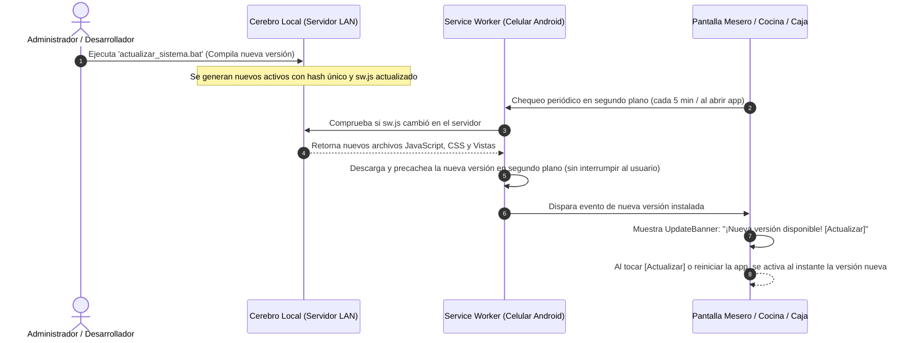

# Manual de Despliegue Android, Operación Offline y Actualizaciones (OTA) — POS Mr. Burger

---

## 1. ¿Cómo se actualiza la app en todos los celulares y tablets cuando hagamos cambios?

Esta es una de las mayores ventajas de la arquitectura elegida (**PWA + Service Worker / WebAPK**):

> **NO tienes que ir teléfono por teléfono con un cable USB ni publicar en Google Play Store.**  
> Cada vez que actualices el sistema en el servidor central (Cerebro Local), **todos los celulares y tablets Android reciben la actualización de forma 100% automática e invisible por la red Wi-Fi (Over-The-Air / OTA)**.

### ¿Cómo funciona el ciclo de actualización técnica?


### 1.1 El Componente Automático `UpdateBanner`
En el frontend ya dejamos integrado el componente [`UpdateBanner.tsx`](file:///C:/Users/jhona/Documents/Default%20Project/frontend/src/components/common/UpdateBanner.tsx):
* Monitorea la presencia de una nueva versión lista para activarse.
* Comprueba periódicamente cada 5 minutos si hay cambios en el servidor central.
* Revisa de inmediato cada vez que el mesero vuelve a encender la pantalla o abrir la app (`visibilitychange`).
* Si hay actualización, despliega una notificación flotante no intrusiva: **"¡Nueva versión disponible! [Actualizar]"**, y al tocarla recarga la aplicación con el nuevo código en menos de 1 segundo.

### 1.2 El Script de 1 Clic para Actualizar el Sistema
En la carpeta [`scripts/`](file:///C:/Users/jhona/Documents/Default%20Project/scripts/) tienes los actualizadores listos:
* **En Windows (Caja):** Doble clic en [`actualizar_sistema.bat`](file:///C:/Users/jhona/Documents/Default%20Project/scripts/actualizar_sistema.bat).
* **Por PowerShell:** `powershell -ExecutionPolicy Bypass -File scripts/actualizar_sistema.ps1`.
* **En Linux / Mini PC:** `bash scripts/actualizar_sistema.sh`.

El script realiza en orden:
1. Respaldo preventivo completo de la base de datos PostgreSQL.
2. Descarga del código nuevo (`git pull`).
3. Recompilación automática de los activos PWA con `npm run build`.
4. Reinicio de los contenedores Docker o servicios backend.
5. Muestra en pantalla la dirección IP para los celulares de los meseros.

---

## 2. Instalación en Dispositivos Android para Pruebas (Método PWA WebAPK)

Para instalar el sistema en los celulares de los meseros o la tablet de cocina en **menos de 30 segundos**:

1. **Conectar el dispositivo a la red Wi-Fi del restaurante:**
   Asegúrate de que el teléfono Android esté conectado a la misma red Wi-Fi donde está conectado el computador/servidor del restaurante.
2. **Abrir Google Chrome en el teléfono Android.**
3. **Ingresar la dirección IP del servidor:**
   Ejemplo: `http://192.168.1.50:5173` (en desarrollo) o `http://192.168.1.50:8000` (en producción).
4. **Instalar como App Nativa:**
   * Chrome mostrará automáticamente un aviso en la parte inferior: **"Agregar Mr. Burger a la pantalla principal"** o **"Instalar aplicación"**.
   * Si no aparece el aviso, toca los tres puntos `⋮` arriba a la derecha en Chrome y selecciona **"Instalar aplicación"**.
5. **Listo:**
   * Android creará un ícono nativo con el logo de Mr. Burger en la pantalla de inicio.
   * La app se abrirá a pantalla completa (modo `standalone`), sin barra de direcciones de navegador, con rendimiento acelerado por hardware y navegación táctil ultra rápida.

---

## 3. Resiliencia ante Puntos Ciegos de Wi-Fi (Cola de Pedidos Offline)

En restaurantes con paredes gruesas o zonas al aire libre, los meseros pueden experimentar microcortes de señal Wi-Fi de 5 a 15 segundos al caminar entre mesas.

Para evitar que una comanda se pierda o el mesero tenga que volver a digitarla:
* Se implementó la utilidad [`offlineQueue.ts`](file:///C:/Users/jhona/Documents/Default%20Project/frontend/src/utils/offlineQueue.ts).
* Si el mesero pulsa *"Enviar Comanda a Cocina"* justo en un punto ciego de señal:
  1. El pedido **NO se pierde ni da error fatal**. Se guarda inmediatamente en el almacenamiento local del teléfono con un ID temporal.
  2. La pantalla del mesero muestra una alerta amigable:  
     `📶 Wi-Fi inestable: Comanda de Mesa #X guardada en tu teléfono. Se enviará sola a cocina al restablecer la señal.`
  3. Aparece una barra indicadora en la parte superior: `[ 1 pedido guardado en el teléfono esperando reconexión Wi-Fi... ]`.
  4. Un temporizador en segundo plano (cada 5 segundos) y un escucha de reconexión de red (`online`) reenvían el pedido a la cocina en cuanto el mesero regresa a una zona con cobertura Wi-Fi.
  5. Se emite la confirmación sonora y visual de pedido recibido en cocina.

---

## 4. Configuración Dinámica de la IP del Servidor en los Teléfonos

Para que los meseros no dependan de una configuración quemada en el código:
* En la pantalla de Login ([`Login.tsx`](file:///C:/Users/jhona/Documents/Default%20Project/frontend/src/pages/Login.tsx)), junto al indicador de **Cerebro Local**, se añadió un botón de engranaje `⚙`.
* Al tocarlo, se abre el modal [`ServerConfigModal.tsx`](file:///C:/Users/jhona/Documents/Default%20Project/frontend/src/components/common/ServerConfigModal.tsx).
* Allí se puede ingresar la IP del computador de caja (ej. `192.168.1.50:8000`), pulsar **"Probar"** para validar la comunicación en vivo con el backend, y guardar.
* La configuración queda almacenada en el dispositivo móvil y se recuerda permanentemente.

---

## 5. Resumen de Flujo Operativo Completo en el Local

```
┌────────────────────────────────────────────────────────────────────────┐
│  RESTAURANTE MR. BURGER (100% OPERATIVO SIN INTERNET)                  │
├────────────────────────────────────────────────────────────────────────┤
│                                                                        │
│   [ CELULAR MESERO ]                                                  │
│   • Abre App Mr. Burger (ícono en pantalla)                            │
│   • Selecciona Mesa 5 -> Toca Especial Doble Res -> Envía Comanda      │
│   • Si el Wi-Fi parpadea, la cola local retiene el pedido y lo envía   │
│                                                                        │
│                  ▼  (Red Wi-Fi Local - Milisegundos)                   │
│                                                                        │
│   [ COMPUTADOR DE CAJA / CEREBRO LOCAL ]                               │
│   • FastAPI + PostgreSQL en LAN (192.168.1.50)                         │
│   • Registra comanda, descuenta ingredientes de inventario (recetas)   │
│   • Notifica por WebSocket instantáneo                                 │
│                                                                        │
│                  ▼                                                     │
│                                                                        │
│   [ TABLET DE COCINA KDS ]                                             │
│   • Suena campana nativa Web Audio                                     │
│   • Aparece comanda de Mesa 5 con temporizador de 28 min               │
│   • Cocinero toca "LISTO" cuando la comida sale                        │
│                                                                        │
│                  ▼                                                     │
│                                                                        │
│   [ PANTALLA DE CAJA ]                                                 │
│   • Mesa 5 lista para cobro                                            │
│   • Cobro en Efectivo con cálculo de cambio o Datafono                 │
│   • Impresión de tirilla térmica 80mm con desglose de IVA (19%)        │
│                                                                        │
│                  ▼ (Solo cuando hay Internet exterior)                 │
│                                                                        │
│   [ NUBE / CELULAR DEL DUEÑO ]                                         │
│   • Worker de sincronización sube las ventas de forma asíncrona        │
│   • El dueño consulta ventas, dinero en caja e inventario en tiempo    │
│     real desde cualquier lugar fuera del restaurante                   │
│                                                                        │
└────────────────────────────────────────────────────────────────────────┘
```
