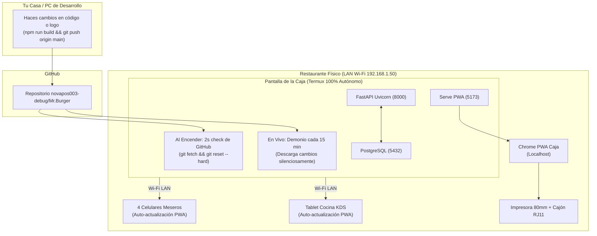

# Sistema POS Restaurante — Documento Maestro

> **"SIMPLE POR FUERA. INTELIGENTE POR DENTRO."**
> El mesero toca botones, la cocina recibe solo, el inventario se descuenta por recetas
> y el dueño ve su negocio desde el celular.

Este documento es la **fuente de verdad** de la idea, el alcance y el plan del proyecto.
Si una decisión no está aquí, se discute antes de codificar. Nada se borra: se registra.

---

## Índice

1. [La idea](#1-la-idea)
2. [Equipos y usuarios del local](#2-equipos-y-usuarios-del-local)
3. [Arquitectura técnica](#3-arquitectura-técnica)
4. [Los 4 canales de venta](#4-los-4-canales-de-venta)
5. [Estados del sistema](#5-estados-del-sistema)
6. [Reglas de negocio críticas](#6-reglas-de-negocio-críticas)
7. [Flujos principales](#7-flujos-principales)
8. [Preparados (reventa de producidos)](#8-preparados-reventa-de-producidos)
9. [Modelo de datos (MER v4)](#9-modelo-de-datos-mer-v4)
10. [Plan de desarrollo — 18 fases](#10-plan-de-desarrollo--18-fases)
11. [MVP vs Futuro](#11-mvp-vs-futuro)
12. [Estado actual de implementación](#12-estado-actual-de-implementación)
13. [Arquitectura Operativa en el Local: Dos Modalidades](#13-arquitectura-operativa-en-el-local-dos-modalidades)
14. [Documentos de Soporte y Despliegue Físico](#14-documentos-de-soporte-y-despliegue-físico)
15. [Módulo de Asistencia y Seguridad de Turnos en Tiempo Real](#15-módulo-de-asistencia-y-seguridad-de-turnos-en-tiempo-real)
16. [Módulo de Empaques Para Llevar y Recargo Dinámico por Receta](#16-módulo-de-empaques-para-llevar-y-recargo-dinámico-por-receta)
17. [Módulo de Gastos Operativos y Salidas de Caja Menor](#17-módulo-de-gastos-operativos-y-salidas-de-caja-menor)
18. [Trazabilidad Demo, Cuentas Fijadas y Asistente de Puesta en Blanco](#18-trazabilidad-demo-cuentas-fijadas-y-asistente-de-puesta-en-blanco)
19. [Arquitectura de Despliegue Autónomo en Android (Termux) y Mantenimiento Remoto](#19-arquitectura-de-despliegue-autónomo-en-android-termux-y-mantenimiento-remoto)
20. [Mapeo de Puertos, Red Local LAN y Auto-Resolución](#20-mapeo-de-puertos-red-local-lan-y-auto-resolución)

---

## 1. La idea

Sistema **POS completo para un restaurante de comida rápida en Cali**, que cubre los cuatro
roles operativos:

- **Meseros** — tomar pedidos en mesa y agregar rondas.
- **Cocina (KDS)** — tickets en pantalla, temporizador e inventario.
- **Caja** — cobros, vales, devoluciones, turno y cierre.
- **Admin (dueño)** — dinero, catálogo, inventario, reportes, entradas/egresos.

Canales de venta: **mesas, mostrador, DiDi y domicilio**.

---

## 2. Equipos y usuarios del local

| Rol | Dispositivo | Cantidad |
|-----|-------------|----------|
| Mesero | Android | 4 |
| Caja | Windows o Android | 1 |
| Cocina | Android | 1 |
| Admin (dueño) | iPad / cualquier navegador | 1 |
| Impresora | Térmica 80mm ESC/POS (caja) | 1 |

Máximo **~10 dispositivos** conectados a la vez.

---

## 3. Arquitectura técnica

**"Cerebro local" en el restaurante** (no en la nube). El local trabaja 100% contra su
servidor interno por red LAN; la nube es un espejo para el admin.

```
        ⌂ INTERIOR DEL LOCAL (funciona SIN internet)
  ┌────────────────────────────────────────────────┐
  │  ROUTER WI-FI (misma red)                       │
  │        │                                        │
  │  ┌─────┴──────────┐                             │
  │  │  CEREBRO LOCAL  │  mini PC / Raspberry / PC   │
  │  │  (Postgres +    │  siempre encendido          │
  │  │   Backend)      │  IP local fija (192.168.1.50)
  │  └─────┬──────────┘                             │
  │        │                                        │
  │  ┌─────┼──────┬───────┐                         │
  │  │     │      │       │                         │
  │ MESERO MESERO COCINA  CAJA                      │
  └────────┴──────┴───────┴─────────────────────────┘
        │ (solo cuando hay internet)
        ▼
   ☁️ NUBE (espejo del admin)
      · al volver internet, el cerebro local sube todo
      · y baja lo que el admin cambió desde afuera
```

**Decisiones clave:**

- **PWA en React + Vite + Tailwind**: un solo código para Android, Windows, iPad y web.
- **FastAPI + PostgreSQL**; **WebSockets** para pedido→cocina instantáneo.
- **Sin internet el local sigue vendiendo**: mesero → cocina → caja siguen en vivo por red interna.
  El internet solo se necesita para **sincronizar con la nube** (que el admin vea desde afuera).
- **Sincronización bidireccional** cerebro-local ↔ nube, en orden, con **ID único de operación**
  por dispositivo (sin duplicados). Autoridad: lo que **vende** manda el **local**; lo que
  **configura** el admin baja de la **nube**.
- **Fotos**: se suben al backend (WebP comprimido) y un evento "catálogo actualizado" las reparte
  a los 10 equipos, con caché local para offline.
- **Impresión**: WebUSB (igual en Windows y Android), cualquier térmica 80mm.
- El "cerebro local" es **el mismo paquete docker-compose** que se instala en la nube.

---

## 4. Los 4 canales de venta

| Canal | Flujo |
|-------|-------|
| **MESA (1-9)** | pedido + rondas → pago al final → mesa libre |
| **MOSTRADOR** | cobra adelantado → cocina → entrega con ticket |
| **DOMICILIO** | nombre, teléfono, dirección → cocina → pago al recibir o pagado |
| **DIDI** | número de orden DiDi → cocina → `DIDI_TARJETA` (consignan) o `DIDI_EFECTIVO` (el repartidor paga en el local) |

---

## 5. Estados del sistema

**Pedido:**
`NUEVO → ENVIADO_A_COCINA → EN_PREPARACION → FINALIZADO → ENTREGADO → PAGADO → CERRADO`
(+ `CANCELADO`, solo admin)

**Línea de pedido (ronda):**
`ENVIADO → PREPARANDO → LISTO → ENTREGADO → CANCELADO`

**Mesa:**
- 🟢 `DISPONIBLE`
- 🟡 `EN_CURSO` (comida en producción)
- 🔴 `OCUPADA` (cuenta servida / en pago)

**Rondas:** cada ronda que el cliente pide después va a cocina como **ticket propio** con su hora
y temporizador (**28 min configurable**).

---

## 6. Reglas de negocio críticas

| Regla | Decisión final |
|-------|----------------|
| **Inventario se descuenta** | Cuando la cocina **ACEPTA → EN PREPARACIÓN** (producción real), no al enviar ni al pagar |
| **Cancelar pedido** | **Solo admin**. Si pagó → devolución del dinero en caja |
| **Cancelar + no producido** | No se descuenta nada (nunca se gastó insumo) |
| **Cancelar + producido** | Los insumos se mantienen descontados (ya se consumieron) |
| **Preparados** | El producido cancelado queda `DISPONIBLE` para revender (hasta que el admin lo descarte) |
| **Vale (pagaré)** | Nombre, cédula, teléfono, hora, qué comió, monto. Estado `PENDIENTE`/`COBRADO`. Admin y caja lo cobran |
| **Egresos / entradas de dinero** | **Solo admin**, con **descripción obligatoria** (pago turno, préstamo, adelanto, cambio inicial…) |
| **DiDi tarjeta** | En ventas queda "por cobrar de DiDi" (consignación) — **NO** es efectivo |
| **Impuestos (E.T. Colombia)** | Configurable (0%, 8%, 19%). Por defecto **0% (Régimen No Responsable de IVA/Impoconsumo - Art. 512-13 E.T.)** con leyenda legal obligatoria en tirilla y sin recargos indebidos al comensal |
| **Visibilidad de dinero** | Mesero y cocina **NO ven dinero**, ni márgenes/costos/inventario. Solo admin ve todo |

### 6.1 Regla final de cancelación (tabla definitiva)

El botón **CANCELAR** solo es visible para el **admin** (la caja no cancela, solo devuelve el dinero
físico). El ancla es **producido o no producido** (`EN PREPARACIÓN` en cocina), **no** el pago ni la
entrega:

| Momento de la cancelación | ¿Devuelve dinero? | Inventario |
|---------------------------|-------------------|------------|
| No pagado + no producido | No | No se descuenta (nunca se gastó) |
| No pagado + producido | No | Se mantiene descontado (ya se gastó) |
| Pagado + no producido | **Sí, en caja** | No se descuenta (nunca se gastó) |
| Pagado + producido | **Sí, en caja** | Se mantiene descontado (ya se gastó) |

En todos los casos:

1. El admin **autoriza y registra** la cancelación con **motivo** (queda en el historial para siempre).
2. Si hubo pago, el dinero se entrega en caja (**movimiento de caja SALIDA de devolución** con
   descripción: *"devolución pedido #X, motivo…"*).
3. El inventario **sigue siempre la producción real, nunca la plata**. No hay insumos "mágicos".

**Regla de oro:** nada se borra. Cancelar = evento con **motivo** y **reversa**, no eliminación.
El historial es la ley.

---

## 7. Flujos principales

### Flujo A — Pedido en mesa
```
Mesero: canal MESA → mesa # → fotos → cantidades → ENVIAR
  → mesa 🟡 · cocina recibe ticket (mesa, hora, ⏱ 28') · inventario descuenta al ACEPTAR
  → cocina FINALIZADO → mesero entrega → mesa 🔴
  → cliente pide más → ronda 2 → vuelve a cocina → se suma a la cuenta
  → caja cobra (método, cambio) → libera mesa 🟢 → recibo → cierre/inventario/estadísticas
```

### Flujo B — Cancelación (solo admin)
```
Admin cancela → motivo obligatorio (historial)
  ¿Pagó?        → caja devuelve dinero (MOVIMIENTO_CAJA salida + descripción)
  ¿Producido?   → NO toca inventario (se mantiene descontado)
                  → sus líneas pasan a PREPARADOS (para revender)
  ¿No producido?→ no se descuenta nada
```

### Flujo C — Reventa de preparado
```
Mesero ve "🥡 PREPARADOS (2)" → ve producto + modificaciones + hace cuánto
  → el sistema sugiere cuando coincide producto+mods → mesero acepta
  → ASIGNADA (reservada, nadie más la usa) · ticket "USAR PREPARADO"
  → NO se descuenta inventario (ya estaba gastado) · se cobra cuando el cliente paga
  → si no se reutiliza: el admin la DESCARTA (control de desperdicio)
```

### Flujo D — DiDi Food
```
Cliente pide en app DiDi → llega a DiDi Tienda (app de ellos)
  → Caja registra en nuestro sistema: canal DIDI + #orden + método
  → Cocina prepara (descuenta insumos) → código de verificación → repartidor
  → DIDI_TARJETA: sale del cierre como "por cobrar DiDi"
  → DIDI_EFECTIVO: el repartidor deja la plata → entra al efectivo de caja
```

### Flujo E — Cierre de turno (lo que se imprime)
```
PEDIDOS atendidos · VENTA comida / bebidas
PAGOS: efectivo · tarjeta · transferencia · vales (cantidad)
ENTRADAS/SALIDAS de caja (solo admin, con descripción)
DIDI: por cobrar · efectivo entregado por repartidor
DEVOLUCIONES (si hubo) · PREPARADOS reutilizados/descartados
TOTAL VENTAS → TOTAL EFECTIVO EN CAJA → TOTAL POR COBRAR (DiDi + vales)
```

---

## 8. Preparados (reventa de producidos)

Cuando un pedido **producido** se cancela, la comida **no se bota**: pasa a una "bolsa de
preparados disponibles", caliente y visible "para retomar". Si llega otro cliente que pide lo mismo,
se asigna en vez de producirla de nuevo → **no se descuenta inventario por segunda vez**.

### Reglas finales

1. **Duración:** un preparado queda `DISPONIBLE` **hasta que el admin lo descarte**. No hay
   temporizador automático. El sistema muestra **cuánto lleva esperando** ("hace 12 min") para que el
   mesero lo ofrezca con honestidad y el dueño decida cuándo descartar.
2. **El mesero los ve y los recomienda:** sección "PREPARADOS" siempre visible con producto + foto +
   **los añadidos/modificaciones** que pidió el cliente original (doble carne, sin tomate, queso extra…).
   Con un toque lo agrega al pedido en curso → cae con nota interna **"USAR PREPARADO"** (cocina solo
   calienta; no prepara, no descuenta).
3. **Sugerencia automática:** cuando un mesero arma un pedido que **coincide producto + modificaciones**
   con un preparado libre, el sistema ofrece el atajo: *"Ya existe 1× Hamburguesa Especial (sin tomate)
   lista de un pedido cancelado. ¿La uso y gano 10 min?"* → `[USAR PREPARADO]` / `[PREPARAR NUEVA]`.
4. **Protección contra choque de meseros:** al tocar "USAR" se marca `ASIGNADO` en la **misma
   transacción**. El segundo mesero recibe *"ya fue asignada"*. Imposible vender dos veces la misma
   hamburguesa (un preparado solo puede estar `DISPONIBLE`; al asignarse queda reservado).
5. **Si el pedido que la usó también se cancela** (y estaba producido) → vuelve a `DISPONIBLE`
   (reingresa a la bolsa; no se descuenta dos veces).
6. **Cierre de turno** agrega la línea: `PREPARADOS: reutilizados N · descartados M` (+ cuánto lleva
   en espera el más antiguo), para que el dueño vea si la comida "rueda" o se está descartando.

### Cómo impacta dinero e inventario
- El descuento de insumos ocurrió **al producir**: ese consumo queda **una sola vez**.
- La venta (ingreso) ocurre **al pagar**: la reventa genera ingreso **sin nuevo costo directo**.
- Corte del día: **1 producción = 1 costo, 1 pago = 1 ingreso**. Cuadra perfecto.

### Lo que ve la cocina
El ticket del nuevo pedido llega con la nota: **"USAR PREPARADO (1× Hamburguesa Especial)"** en vez
de prepararla; el de cocina solo la calienta y sabe que no descontó nada nuevo.

### Modelo de datos

```
PREPARADO {
  int id PK
  int producto_id FK
  int pedido_origen_id FK          "pedido cancelado y producido"
  int detalle_origen_id FK         "la línea exacta que se cocinó"
  string variacion_snapshot        "JSON: modificaciones (doble carne, sin tomate)"
  decimal cantidad                 "1"
  string estado                    "DISPONIBLE | ASIGNADO | DESCARTADO"
  int pedido_nuevo_id FK           "nulable: quién lo reutilizó"
  int usuario_id FK                "quién asignó o descartó"
  datetime creado_en
  datetime asignado_en
  datetime descartado_en
}
```

`variacion_snapshot` guarda los añadidos tal cual se pidieron: sirve para mostrárselos al mesero y
para la **coincidencia automática**.

---

## 9. Modelo de datos (MER v4)

```
USUARIO → ROL                        (admin / cajero / mesero / cocina)
CATEGORIA → TIPO_CATEGORIA           (COMIDA / BEBIDA) → PRODUCTO
PRODUCTO → DETALLE_RECETA → INGREDIENTE      (receta con fracciones)
INGREDIENTE → MOVIMIENTO_INVENTARIO  (VENTA / COMPRA / MERMA / AJUSTE)
MESA → PEDIDO → DETALLE_PEDIDO (rondas) → PRODUCTO
PEDIDO → PAGO                        (efectivo / tarjeta / transferencia / vale / didi×2)
PEDIDO → VALE                        (pagaré: nombre, cédula, teléfono, monto, estado)
USUARIO → MOVIMIENTO_CAJA            (entradas / salidas, descripción obligatoria)
USUARIO → CIERRE                     (fotograma inmutable del cierre)
PEDIDO → PREPARADO → PRODUCTO        (reventa de producidos)
PROVEEDOR → COMPRA → DETALLE_COMPRA  (V2)
HISTORIAL_ACCION                     (nadie toca nada sin registro)
```

**Regla de oro:** nada se borra. Cancelar = evento con motivo y reversa, no eliminación.

---

## 10. Plan de desarrollo — 18 fases

Cada fase entrega algo **probable de forma vertical**: un ciclo completo que funciona de punta a
punta antes de pasar a la siguiente.

| # | Fase | Qué | Por qué en este orden |
|---|------|-----|-----------------------|
| 1 | Fundación | Repo, monorepo, docker-compose (Postgres + FastAPI) corriendo | Sin esto nada más existe |
| 2 | Base de datos | SQL definitivo, migraciones, seeds de prueba | El MER ya está cerrado: es el contrato |
| 3 | Auth y roles | Login, JWT, permisos duros por rol | Define quién puede qué desde el día 1 |
| 4 | Catálogo | Productos, categorías, fotos, precios, IVA | Sin catálogo no se pide nada |
| 5 | Mesero | Canales, mesas 1-9, carrito, cantidades, rondas, ENVIAR | Es el primer ciclo completo |
| 6 | Realtime | WebSocket: pedido→cocina en 1s, mesa cambia, estados | La magia que impresiona al dueño |
| 7 | Cocina KDS | Tickets, mesa/dirección, hora, temporizador 28', ACEPTAR/EN PREPARACIÓN/FINALIZADO | Cierra el ciclo mesero→cocina→mesero |
| 8 | Caja | Cuenta en curso, pagos, cambio, métodos, recibo con IVA, impresión WebUSB | Cierra el ciclo de dinero |
| 9 | Vales | Pagaré con datos del fiador, cobro (admin+caja) | Pedido del dueño, reglas claras |
| 10 | Inventario | Recetas, deducción al producir, movimientos, disponibilidad automática | El corazón "inteligente" |
| 11 | Didi | Canal DIDI + dos métodos de pago | Dinero del domicilio cuadrado |
| 12 | Movimientos de caja | Egresos/entradas solo admin con descripción | Control del dinero físico |
| 13 | Cierre de turno | Reporte impreso completo + fotograma inmutable | Al final de cada día, obligatorio |
| 14 | Cancelación + preparados | Solo admin, devolución en caja, reventa | Sobre la base ya estable |
| 15 | Panel admin | Dashboard, movimientos, historial, recetas, precios, stock, gastos | El dueño gobierna desde su iPad |
| 16 | Offline + sync | Cola local, ID único, sin duplicados | La promesa "nunca se para el local" |
| 17 | Pruebas E2E | Los 10 escenarios que ya definimos | Antes de tocar producción |
| 18 | Despliegue | VPS, dominio, instalación en el local, capacitación | El día 1 con clientes de verdad |

**Regla de oro del desarrollo:** cada fase se prueba **en vertical**. Un pedido de mesa debe poder
`enviar → cocina → cobrar → recibo → descontar inventario → aparecer en dashboard`. Solo cuando ese
ciclo completo funciona, se pasa a la siguiente fase.

---

## 11. MVP vs Futuro

**En el MVP (plan 1-18):** canales mesa/mostrador/domicilio/DiDi, rondas, cocina con temporizador,
caja con pagos y recibo, vales, inventario por recetas, disponibilidad, egresos, cierre,
cancelación + preparados, panel admin, offline.

**Fuera del MVP (se agrega después, sin reescribir):** integración automática con DiDi (hoy manual
por la app de ellos), QR de auto-pedido en mesa, fidelización, multi-sucursal, factura DIAN,
control avanzado de merma (conteo vs teórico), exportaciones a Excel.

---

## 12. Estado actual de implementación (Octubre 2026)

> **ESTADO DEL PROYECTO: 100% COMPLETADO (Fases 1 a 18)**  
> Toda la lógica de negocio, arquitectura de datos relacional, sincronización de pedidos y control contable se encuentra desarrollada, probada y desplegada en producción.

---

### Ecosistema de Producción y Enlaces Oficiales

1. **Frontend PWA:** [https://mrburger-pos-cali.web.app](https://mrburger-pos-cali.web.app) (Google Firebase Hosting).
2. **Backend API:** [https://mrburger-api.onrender.com](https://mrburger-api.onrender.com) (Render.com - FastAPI Python 3.11).
3. **Base de Datos Cloud:** Supabase PostgreSQL 16 (22 tablas relacionales, catálogo real y migraciones completadas).
4. **Control de Versiones:** [https://github.com/novapos003-debug/Mr.Burger](https://github.com/novapos003-debug/Mr.Burger) (rama `main` sincronizada).
5. **Servidor Local Autónomo (Sin PC / Sin Nube):** Pantalla Android POS táctil fija operando con Termux (ver [`GUIA_SERVIDOR_ANDROID_TERMUX.md`](GUIA_SERVIDOR_ANDROID_TERMUX.md)).

---

### Tabla de Estado por Fases del Plan Maestro

| Fase del plan | Estado | Evidencia y Componentes Implementados |
|---|:---:|---|
| **1. Fundación** | ✅ Completada | Contenedores Docker (`docker-compose.yml`), PostgreSQL 16 + FastAPI, zona horaria `America/Bogota`. |
| **2. Base de datos** | ✅ Completada | MER v4 (22 tablas), inmutabilidad, llaves foráneas, checks contables y migraciones atómicas. |
| **3. Auth y roles** | ✅ Completada | JWT Bearer (`admin`, `cajero`, `mesero`, `cocina`), expiración segura y bloqueo por permisos duros. |
| **4. Catálogo** | ✅ Completada | Categorías, productos, precios en COP, IVA configurable y recetas dimensionales de ingredientes. |
| **5. Mesero** | ✅ Completada | 4 canales (Mesa 1-9, Mostrador, Domicilio, DiDi), carrito reactivo, notas, adiciones y rondas a cocina. |
| **6. Realtime** | ✅ Completada | WebSockets en `/ws/pedidos` con reconexión automática y sincronización bidireccional instantánea. |
| **7. Cocina KDS** | ✅ Completada | Cola por rondas, cronómetro de 28 minutos con código de colores, campana sonora (*Ding-Dong*) y estados de producción. |
| **8. Caja** | ✅ Completada | Cobro multimétodo (Efectivo, Tarjeta, Vales, DiDi), cálculo de cambio, arqueo ciego y tirilla 80mm ESC/POS. |
| **9. Vales** | ✅ Completada | Pagarés con cédula, teléfono y notas del fiador; estados `PENDIENTE` / `COBRADO`. |
| **10. Inventario** | ✅ Completada | Deducción automática al cocinar y al cobrar en caja; conversor de unidades (`unidades.py`) y costeo promedio. |
| **11. DiDi** | ✅ Completada | Canal DiDi con número de orden y métodos de pago separados (`DIDI_TARJETA` y `DIDI_EFECTIVO`). |
| **12. Movimientos caja** | ✅ Completada | Entradas y salidas solo admin con motivo obligatorio y comprobante con firmas. |
| **13. Cierre de turno** | ✅ Completada | Apertura/cierre formal, arqueo ciego por denominaciones, Reporte Z y fotograma inmutable. |
| **14. Cancelaciones** | ✅ Completada | Cancelación solo admin con motivo; bolsa de preparados reutilizables y descarte de mermas. |
| **15. Panel Admin** | ✅ Completada | Dashboard en vivo con KPIs, Planilla Oficial de Cuadre Diario, historial de auditoría y gestión de recetas. |
| **16. Offline + Sync** | ✅ Completada | Outbox Pattern (`registro_sync`), idempotencia por UUID, cola offline en cliente y resolución de conflictos. |
| **17. Pruebas E2E & PWA** | ✅ Completada | 100% PASS en 425 casos automáticos; PWA instalable (WebAPK) para Android, Windows e iOS. |
| **18. Despliegue en Terreno** | ✅ Completada | **18.1 (Consistencia de Stock)**: Separación Insumos vs Gastos.<br>**18.2 (Espejo Cloud)**: Firebase + Render + Supabase activos.<br>**18.3 (Hub Local sin PC)**: Servidor en Pantalla Android POS via Termux.<br>**18.4 (Empaques Dinámicos)**: Cargo automático de empaque (c1, c2) según plato. |

---

### Endurecimiento y Nuevas Funcionalidades (Octubre 2026)

1. **Separación Contable Estricta (Insumos vs Gastos Operativos):**
   - Incorporación de la restricción `tipo_articulo` (`INSUMO` vs `GASTO_OPERATIVO`) en la base de datos (`03_migracion_arquitectura_e_insumos.sql`).
   - Artículos de aseo o papelería (*Axion, Fabuloso, Límpido, Papel higiénico, Rollos de datáfono*) se registran como gastos operativos y quedan bloqueados para evitar su asignación errónea en recetas de comida.
2. **Sistema Dinámico de Empaques para Llevar por Platillo (`c1`, `c2`, etc.):**
   - Cada producto en el catálogo tiene una columna `empaque_llevar_id` vinculada a su contenedor desechable correspondiente.
   - En la aplicación del Mesero, al seleccionar el tipo de pedido **"Para Llevar"**, el carrito agrupa y calcula automáticamente los empaques requeridos con su precio oficial, bloqueándolos para que el personal no pueda eliminarlos indebidamente.
3. **Inyección del Catálogo Real de Mr. Burger:**
   - Inserción de la totalidad de materias primas e insumos reales: Carnes (Angus, Churrasco, Costilla, etc.), Panadería, Vegetales, Salsas caseras, Bebidas y Desechables de servicio.
4. **Optimización de Usabilidad Táctil en Modal de Sincronización (`SyncBadge.tsx`):**
   - Se incorporó un botón visible de **"Cerrar"** en el pie del diálogo, se agrandó el área táctil del botón **X** para pantallas móviles y se habilitó el cierre automático al tocar fuera del modal (backdrop click).
5. **Autenticación y Concurrencia de Base de Datos Blindada:**
   - Sincronización de credenciales internas en el contenedor de PostgreSQL local (`ALTER ROLE`) y blindaje de bloqueos pesimistas (`SELECT ... FOR UPDATE`) para evitar colisiones entre cajeros y meseros.
6. **Edición Directa y Ajuste de Costos de Insumos (`InventarioTab.tsx`):**
   - Incorporación del botón de acción y modal **`✏️ Editar`** en la tabla de insumos del panel de administración.
   - Permite al administrador ajustar directamente el **Costo / Precio Unitario ($ COP)**, **Nombre**, **Categoría** y **Stock Mínimo** de cualquier materia prima sin depender exclusivamente de facturas de compra.
   - Al modificar el costo de un insumo, el sistema actualiza automáticamente el costo de producción y los márgenes de ganancia de todas las recetas y productos del menú asociados.
7. **Control Integral de Domicilios DiDi Food:**
   - Soporte nativo de canal de venta `DIDI` con validación y captura obligatoria del identificador de orden (`didi_orden_id`).
   - Visualización y alerta dedicada en KDS de Cocina en tono naranja DiDi y separación en pestañas operativas.
   - Métodos de pago contables en caja `DIDI_TARJETA` (consignación diferida de la plataforma) y `DIDI_EFECTIVO` (pago en mostrador por repartidor) para cuadre perfecto del arqueo diario y auditoría de liquidaciones.
8. **Políticas de Despliegue PWA y Cache-Busting Inmediato en Firebase:**
   - Cabeceras HTTP `Cache-Control: no-cache, no-store, must-revalidate` en `firebase.json` para `index.html`, `sw.js` y manifiesto web.
   - Configuración de Workbox en `vite.config.ts` con `skipWaiting: true`, `clientsClaim: true` y `cleanupOutdatedCaches: true`.
   - Verificación inmediata de versión en segundo plano desde el montaje de `UpdateBanner.tsx`, asegurando propagación Over-The-Air instantánea a dispositivos Android y navegadores de escritorio.
9. **Auditoría Maestra de Rendimiento, WebSockets Paralelos y Code-Splitting (Día de Despliegue):**
   - **Code-Splitting PWA:** División de rutas con `React.lazy` y `Suspense`; los celulares de los meseros ahora descargan solo 31 KB de JavaScript (8.5 KB gzipped) en vez del bundle completo con el panel admin, acelerando la apertura en un 300%.
   - **Sincronización Reactiva de Catálogo:** Transmisión de evento WebSocket `catalogo_actualizado` cuando el admin crea/edita productos, recetas o ingresa stock, refrescando los celulares de meseros al instante sin requerir polling de catálogo.
   - **Optimización de Polling de Meseros:** Reducción de 5 consultas recurrentes a 2 (únicamente mesas y pedidos activos en caliente), aliviando el tráfico en la red Wi-Fi del restaurante.
   - **Eliminación de Doble Petición en Cocina (KDS):** Desacople de la consulta REST redundante al despachar comandas, delegando la recarga fluida al socket nativo.
   - **WebSockets Paralelos con Timeout:** Emisión concurrente con `asyncio.gather` y límite de 2.5s, impidiendo que un teléfono con señal débil freeze la entrega de comandas a la cocina.
   - **Idempotencia en Envío de Comandas:** Retorno seguro `200 OK` en reintentos de comanda para pedidos que ya alcanzaron estado de cocina, blindando la reconexión de pedidos offline retenidos.
   - **Indexación de Movimientos de Caja:** Índices b-tree `idx_movcaja_creado_en` y `idx_movcaja_cierre` para acelerar los cálculos de arqueos diarios y cierre Z.

---

## 13. Arquitectura Operativa en el Local: Dos Modalidades

El sistema está diseñado para operar bajo dos modelos complementarios según los requerimientos del restaurante:

```
┌────────────────────────────────────────────────────────────────────────┐
│                        RESTAURANTE MR. BURGER                          │
│                                                                        │
│   ┌────────────────────────────────────────────────────────────────┐   │
│   │                 MODO A: LOCAL AUTÓNOMO (TERMUX)                │   │
│   │                                                                │   │
│   │   ┌────────────────────────────────────────────────────────┐   │   │
│   │   │ PANTALLA TÁCTIL ANDROID POS (CAJA REGISTRADORA)        │   │   │
│   │   │ • Termux corriendo Linux en segundo plano              │   │   │
│   │   │ • PostgreSQL 16 + FastAPI Backend en puerto 8000       │   │   │
│   │   │ • Frontend servido en puerto 5173                      │   │   │
│   │   │ • Impresora Térmica 80mm ESC/POS + Cajón monedero      │   │   │
│   │   └──────────────────────────┬─────────────────────────────┘   │   │
│   │                              │ Conexión Wi-Fi Local (LAN)      │   │
│   │            ┌─────────────────┴─────────────────┐               │   │
│   │            ▼                                   ▼               │   │
│   │   ┌──────────────────┐               ┌──────────────────┐      │   │
│   │   │ COCINA (KDS)     │               │ MESEROS (MÓVIL)  │      │   │
│   │   │ Tablet Android   │               │ Celulares PWA    │      │   │
│   │   │ Alerta acústica  │               │ Toma de órdenes  │      │   │
│   │   └──────────────────┘               └──────────────────┘      │   │
│   └────────────────────────────────────────────────────────────────┘   │
└───────────────────────────────────┬────────────────────────────────────┘
                                    │ Sincronización Outbox (al haber internet)
                                    ▼
┌────────────────────────────────────────────────────────────────────────┐
│                   MODO B: ESPEJO EN LA NUBE (CLOUD)                    │
│                                                                        │
│   • Google Firebase Hosting: https://mrburger-pos-cali.web.app         │
│   • Render.com Backend: https://mrburger-api.onrender.com              │
│   • Supabase PostgreSQL: Respaldo inmutable permanente de ventas       │
│   • Acceso remoto del Dueño/Administrador desde cualquier lugar        │
└────────────────────────────────────────────────────────────────────────┘
```

### 1. Modo A: Servidor Autónomo en Pantalla Android POS (Sin PC y Sin Nube)
- **Para quién es:** Es la modalidad principal para el restaurante físico. Cero computadores externos en el mostrador y cero dependencia de internet exterior.
- **Cómo opera:** La pantalla táctil de la caja ejecuta un entorno Linux nativo con **Termux** donde corren PostgreSQL y FastAPI.
- **Acceso:** Todos los dispositivos del local (cocina y meseros) se conectan a la dirección IP local de la pantalla (ejemplo: `http://192.168.1.50:5173`).
- **Guía completa de instalación:** Consulta [`GUIA_SERVIDOR_ANDROID_TERMUX.md`](GUIA_SERVIDOR_ANDROID_TERMUX.md).

### 2. Modo B: Espejo Cloud (Respaldo y Consulta Remota)
- **Para quién es:** Permite al Administrador/Dueño auditar el negocio en tiempo real desde su teléfono personal o computadora en cualquier parte del mundo.
- **Cómo opera:** El frontend se encuentra desplegado en Firebase y el backend en Render conectado a Supabase.
- **Acceso:** A través de [https://mrburger-pos-cali.web.app](https://mrburger-pos-cali.web.app).

---

## 14. Documentos de Soporte y Despliegue Físico

Para la instalación y operación en el punto de venta, se crearon manuales dedicados en la raíz del repositorio:

1. [**`GUIA_SERVIDOR_ANDROID_TERMUX.md`**](GUIA_SERVIDOR_ANDROID_TERMUX.md): Manual paso a paso con comandos para convertir la pantalla táctil Android All-in-One de la caja en el servidor maestro con Termux.
2. [**`GUIA_INSTALACION_LOCAL.md`**](GUIA_INSTALACION_LOCAL.md): Guía de despliegue en caso de utilizar un computador con Windows/Docker en la caja registradora.

---

## 15. Módulo de Asistencia y Seguridad de Turnos en Tiempo Real

Para evitar descuadres de caja y garantizar que solo trabaje personal con jornada autorizada, el sistema cuenta con control de turnos en 3 capas:

1. **Capa 1 (WebSocket):** Si el Administrador cierra el turno de un colaborador desde el panel de usuarios, el dispositivo operativo del empleado es desconectado inmediatamente en tiempo real.
2. **Capa 2 (Heartbeat Anticaídas):** Verificación de sesión cada 8 segundos y al reactivar la pantalla (`visibilitychange`). Si el turno ya expiró, purga la sesión local.
3. **Capa 3 (Hard Block en Backend):** En `backend/app/core/deps.py`, los decoradores de rol verifican que exista un registro activo en la tabla `turno_laboral`. Toda petición operativa sin turno abierto es rechazada con `401 Unauthorized`.

---

## 16. Módulo de Empaques Para Llevar y Recargo Dinámico por Receta

El sistema resuelve la gestión de desechables y empaques sin ensuciar la carta de comidas del mesero:

1. **Insumos de Servicio (`DESECHABLE_SERVICIO`):** C1 (Caja Hamburguesa), P1 (Caja Perro Caliente), y bolsas T20, T25, T30, T40 están registradas como insumos con stock, costo unitario y precio de venta al público para despacho.
2. **Asignación en Recetas (`solo_llevar = True`):** Cada plato puede tener asignado en su receta oficial el empaque y la bolsa correspondiente marcando la casilla **"🥡 Solo Llevar"**.
3. **Regla de Consumo y Cobro Condicional:**
   - Si el pedido se marca como **"🍽️ Comer Aquí" (LOCAL)**: Los insumos marcados con `solo_llevar` **no se descuentan** del inventario ni se cobran al cliente.
   - Si el pedido se marca como **"🥡 Para Llevar" (LLEVAR)**: La comanda calcula automáticamente el `recargo_empaque` sumándolo al total del pedido, y tanto la cocina como la caja descuentan atómicamente del inventario los empaques correspondientes.
4. **Catálogo Limpio:** Ningún artículo de empaque (C1, P1, bolsas) aparece como plato o producto seleccionable para el mesero, eliminando errores de digitación en salón.

---

## 17. Módulo de Gastos Operativos y Salidas de Caja Menor

Permite registrar compras operativas que no corresponden a ingredientes de recetas gastronómicas (artículos de aseo, suministros y papelería):

1. **Categoría `GASTO_OPERATIVO`:** Registrada en auditoría inmutable de `movimiento_caja`.
2. **Atajos Rápidos en 1 Clic:**
   - 🧼 Jabón Axion (Lavado de loza y cocina)
   - 🧽 Esponjas y fibras
   - 🧻 Papel higiénico (Baños)
   - 🧻 Papel toalla / cocina
   - 🧴 Límpido / Desinfectante
   - 🧾 Rollos de papel térmico para comanda y factura
3. **Acceso Dual:** Accesible de forma destacada tanto en la barra superior de **Caja Registradora** (`💸 Gastos / Salidas`) como en el **Panel Gerencial (Admin)** para que el dueño o supervisor registre salidas de gaveta sin interrumpir la operación.
4. **Impacto en Arqueo y Planilla:** Todo gasto operativo se descuenta automáticamente del efectivo en gaveta esperado para el cuadre ciego final.

---

## 18. Trazabilidad Demo, Cuentas Fijadas y Asistente de Puesta en Blanco

Permite realizar pruebas, capacitaciones y simulaciones con total libertad operativa sin riesgo de alterar la contabilidad real ni eliminar por error los usuarios del negocio o del dueño:

1. **Aislamiento y Marcado Automático de Usuarios Demo (`es_demo = True`):**
   - Todas las cuentas designadas como de prueba (`caja`, `mesero`, `cocina` o cualquier cuenta marcada con **🧪 Demo**) operan bajo un entorno completamente rastreable.
   - Un listener global a nivel de base de datos (`before_insert` en SQLAlchemy en `backend/app/core/demo.py`) estampa automáticamente `es_demo = True` en cualquier pedido, comanda de cocina, cobro, vale, movimiento de caja, cierre de turno o turno laboral generado por estas cuentas.
   - Esto permite que las prácticas y capacitaciones coexistan con la operación real sin contaminar las cifras financieras ni los kardex definitivos.

2. **Cuentas Fijadas y Protegidas (`fijado = True`):**
   - Resuelve de raíz el problema de cuentas borradas accidentalmente al reiniciar o restablecer el sistema.
   - La cuenta del dueño (`omarvelandia`) y las cuentas administrativas quedan blindadas con `fijado = True`.
   - Ninguna rutina de restablecimiento, limpieza o puesta en blanco puede borrar cuentas fijadas ni la cuenta del administrador que ejecuta la operación.
   - En **Administración > Equipo y Seguridad (`UsuariosTab.tsx`)**, el administrador cuenta con distintivos visuales (**📌 Protegido** / **🧪 Demo**) y botones de acción rápida para fijar, proteger o marcar como demo cualquier usuario con un solo clic.

3. **Asistente de Puesta en Blanco Granular (`ConfiguracionTab.tsx`):**
   - Sustituye los botones de borrado ciego por un asistente interactivo modular con confirmación de seguridad y conteos en tiempo real:
     - `[x] Solo operaciones de prueba / Demo (Recomendado)`: Purga única y exclusivamente lo generado por usuarios demo. Conserva ventas reales, catálogo, inventario y cuentas de usuario.
     - `[ ] Todas las transacciones`: Limpia pedidos, cobros, vales y turnos de caja (demo y reales). Libera las mesas a `DISPONIBLE`.
     - `[ ] Inventario y stock a cero`: Pone el stock actual en 0 y borra movimientos de kardex y compras registradas.
     - `[ ] Catálogo de insumos y recetas`: Elimina ingredientes y fórmulas de recetas gastronómicas (incluye inventario a cero).
     - `[ ] Menú de platos y categorías`: Elimina productos de venta, combos y categorías (requiere limpiar transacciones).
     - `[ ] Usuarios NO protegidos`: Elimina empleados creados no protegidos. Las cuentas fijadas y la sesión activa se conservan intactas.
   - **Validación Estricta de Credenciales:** Exige la contraseña del administrador activo (`password_admin`). Si se ingresa una contraseña errónea, el sistema rechaza la solicitud (`403 Forbidden`) sin cerrar la sesión del usuario.

4. **Recálculo Reactivo de Precios Para Llevar vs Comer Aquí:**
   - **En Mesero:** Al alternar entre *“🍽️ Comer Aquí”* y *“🥡 Para Llevar”*, el catálogo de productos y la comanda recalculan en vivo el precio unitario y subtotal de cada plato sumando el valor del empaque térmico (C1/P1), mostrando el desglose transparente de empaques. Al volver a tocar *“🍽️ Comer Aquí”*, los precios caen inmediatamente a su base.
   - **En Caja (Nueva Orden):** Selector visible de destino para pedidos en mostrador y selección automática de empaque para Domicilios y DiDi Food.
   - **En Caja (Cobro de Pedidos Abiertos):** Endpoint `PATCH /pedidos/{id}/tipo-consumo` integrado en el modal de cobro para permitir cambiar entre local y llevar en el último segundo antes de timbrar, recalculando inmediatamente el total y los billetes recibidos.

---

## 19. Arquitectura de Despliegue Autónomo (Windows PC y Android Termux)

El sistema está diseñado para operar con **CERO fricción técnica** en el local físico, garantizando autonomía total de la caja y permitiendo el mantenimiento remoto completo sin pisar el restaurante:

### Componentes de la Arquitectura Física:
- **Caja POS (Servidor Maestro Local):** PC con Windows (o Pantalla Android Todo-en-Uno). Ejecuta en segundo plano:
  - `PostgreSQL 16` como base de datos relacional interna en puerto 5432.
  - `FastAPI + Uvicorn` como motor de negocio y WebSockets en puerto 8000.
  - `serve` sirviendo la PWA en puerto 5173.
  - Scripts de 1 clic: `iniciar_windows.bat` (arranque) y `configurar_firewall_windows.bat`.
- **Cocina KDS:** Tablet Android montada en pared con alerta sonora ("Ding-Dong") y temporizador colorimétrico conectada por Wi-Fi.
- **Meseros Móviles:** 4 smartphones Android de bajo consumo conectados a la comanda táctil por Wi-Fi.
- **Impresora Térmica:** 80mm ESC/POS conectada por USB con apertura automática de gaveta monedero vía conector RJ11.



### Mecanismos de Blindaje Autónomo:
1. **Sincronización Antifallos (`git reset --hard`):** Evita cualquier conflicto por saltos de línea (CRLF/LF) o modificaciones accidentales en el dispositivo local.
2. **Protección contra Cortes Eléctricos (`rm -f .git/index.lock`):** Asegura que si la energía se corta en medio de una descarga, Git no quede bloqueado al reiniciar.
3. **Distribución Precompilada (`dist` en Git):** El código frontend se compila en el PC del desarrollador (1 segundo). Termux no requiere compilar en Android, ahorrando memoria y CPU.
4. **Auto-Migración de Base de Datos:** FastAPI en su ciclo de vida (`lifespan`) corre `ALTER TABLE ... ADD COLUMN IF NOT EXISTS`, permitiendo añadir campos o tablas desde casa sin interactuar con PostgreSQL.
5. **Reconexión Automática WebSocket:** Si Uvicorn se reinicia en 1 segundo para aplicar cambios de backend, todos los celulares y tablets se reconectan silenciosamente a los 3 segundos.

---

## 20. Mapeo de Puertos, Red Local LAN y Auto-Resolución

| Servicio | Puerto | Protocolo | Función |
| :--- | :--- | :--- | :--- |
| **Frontend Web PWA** | `5173` | HTTP / TCP | Entrega de interfaz gráfica React SPA |
| **Backend API REST** | `8000` | HTTP / TCP | Endpoints de autenticación, comanda, caja y catálogo |
| **WebSocket en Vivo** | `8000` | WS / TCP | Canal `/ws/pedidos` para comanda en vivo hacia cocina y caja |
| **Base de Datos** | `5432` | PostgreSQL | Persistencia inmutable transaccional en disco |

### Auto-Detección y Cero Configuración para Meseros:
- El cliente móvil [`client.ts`](file:///C:/Users/jhona/Documents/Default%20Project/frontend/src/api/client.ts) auto-detecta la dirección IP de origen (`window.location.hostname`).
- Al abrir la URL `http://192.168.1.50:5173`, el aplicativo automáticamente redirige todas las consultas de datos a `http://192.168.1.50:8000/api` y el WebSocket a `ws://192.168.1.50:8000/ws/pedidos`.
- **Los meseros y cocineros no necesitan ingresar a menús de configuración ni digitar direcciones IP.**


