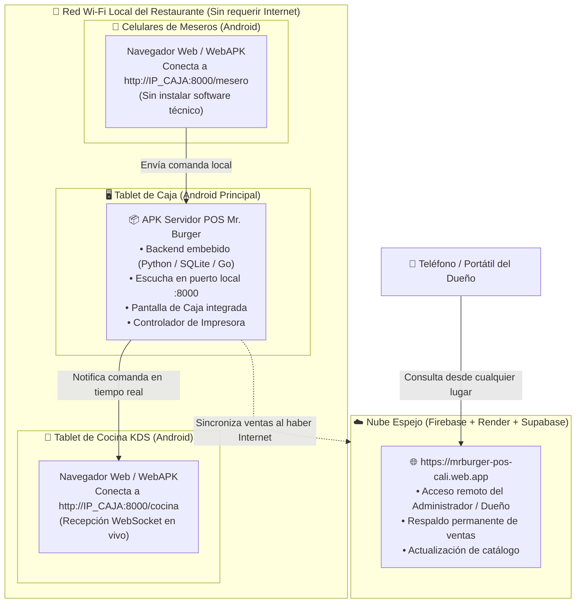

# Sistema POS Restaurante — Documento Maestro

> **"SIMPLE POR FUERA. INTELIGENTE POR DENTRO."**
> El mesero toca botones, la cocina recibe solo, el inventario se descuenta por recetas
> y el dueño ve su negocio desde el celular.

Este documento es la **fuente de verdad** de la idea, el alcance y el plan del proyecto.
Si una decisión no está aquí, se discute antes de codificar. Nada se borra: se registra.

---

## Índice

1. [La idea](#1-la-idea)
2. [Equipos y usuarios del local](#2-equipos-y-usuarios-del-local)
3. [Arquitectura técnica](#3-arquitectura-técnica)
4. [Los 4 canales de venta](#4-los-4-canales-de-venta)
5. [Estados del sistema](#5-estados-del-sistema)
6. [Reglas de negocio críticas](#6-reglas-de-negocio-críticas)
7. [Flujos principales](#7-flujos-principales)
8. [Preparados (reventa de producidos)](#8-preparados-reventa-de-producidos)
9. [Modelo de datos (MER v4)](#9-modelo-de-datos-mer-v4)
10. [Plan de desarrollo — 18 fases](#10-plan-de-desarrollo--18-fases)
11. [MVP vs Futuro](#11-mvp-vs-futuro)
12. [Estado actual de implementación](#12-estado-actual-de-implementación)
13. [Matriz Comparativa — Lo Planeado vs. Lo Implementado](#13-matriz-comparativa--lo-planeado-vs-lo-implementado)
14. [Hardware y Estrategia de Operación en el Local](#14-hardware-y-estrategia-de-operación-en-el-local)
15. [Anexo A — Prompts para presentación al cliente](#anexo-a--prompts-para-presentación-al-cliente)

---

## 1. La idea

Sistema **POS completo para un restaurante de comida rápida en Cali**, que cubre los cuatro
roles operativos:

- **Meseros** — tomar pedidos en mesa y agregar rondas.
- **Cocina (KDS)** — tickets en pantalla, temporizador e inventario.
- **Caja** — cobros, vales, devoluciones, turno y cierre.
- **Admin (dueño)** — dinero, catálogo, inventario, reportes, entradas/egresos.

Canales de venta: **mesas, mostrador, DiDi y domicilio**.

---

## 2. Equipos y usuarios del local

| Rol | Dispositivo | Cantidad |
|-----|-------------|----------|
| Mesero | Android | 4 |
| Caja | Windows o Android | 1 |
| Cocina | Android | 1 |
| Admin (dueño) | iPad / cualquier navegador | 1 |
| Impresora | Térmica 80mm ESC/POS (caja) | 1 |

Máximo **~10 dispositivos** conectados a la vez.

---

## 3. Arquitectura técnica

**"Cerebro local" en el restaurante** (no en la nube). El local trabaja 100% contra su
servidor interno por red LAN; la nube es un espejo para el admin.

```
        ⌂ INTERIOR DEL LOCAL (funciona SIN internet)
  ┌────────────────────────────────────────────────┐
  │  ROUTER WI-FI (misma red)                       │
  │        │                                        │
  │  ┌─────┴──────────┐                             │
  │  │  CEREBRO LOCAL  │  mini PC / Raspberry / PC   │
  │  │  (Postgres +    │  siempre encendido          │
  │  │   Backend)      │  IP local fija (192.168.1.50)
  │  └─────┬──────────┘                             │
  │        │                                        │
  │  ┌─────┼──────┬───────┐                         │
  │  │     │      │       │                         │
  │ MESERO MESERO COCINA  CAJA                      │
  └────────┴──────┴───────┴─────────────────────────┘
        │ (solo cuando hay internet)
        ▼
   ☁️ NUBE (espejo del admin)
      · al volver internet, el cerebro local sube todo
      · y baja lo que el admin cambió desde afuera
```

**Decisiones clave:**

- **PWA en React + Vite + Tailwind**: un solo código para Android, Windows, iPad y web.
- **FastAPI + PostgreSQL**; **WebSockets** para pedido→cocina instantáneo.
- **Sin internet el local sigue vendiendo**: mesero → cocina → caja siguen en vivo por red interna.
  El internet solo se necesita para **sincronizar con la nube** (que el admin vea desde afuera).
- **Sincronización bidireccional** cerebro-local ↔ nube, en orden, con **ID único de operación**
  por dispositivo (sin duplicados). Autoridad: lo que **vende** manda el **local**; lo que
  **configura** el admin baja de la **nube**.
- **Fotos**: se suben al backend (WebP comprimido) y un evento "catálogo actualizado" las reparte
  a los 10 equipos, con caché local para offline.
- **Impresión**: WebUSB (igual en Windows y Android), cualquier térmica 80mm.
- El "cerebro local" es **el mismo paquete docker-compose** que se instala en la nube.

---

## 4. Los 4 canales de venta

| Canal | Flujo |
|-------|-------|
| **MESA (1-9)** | pedido + rondas → pago al final → mesa libre |
| **MOSTRADOR** | cobra adelantado → cocina → entrega con ticket |
| **DOMICILIO** | nombre, teléfono, dirección → cocina → pago al recibir o pagado |
| **DIDI** | número de orden DiDi → cocina → `DIDI_TARJETA` (consignan) o `DIDI_EFECTIVO` (el repartidor paga en el local) |

---

## 5. Estados del sistema

**Pedido:**
`NUEVO → ENVIADO_A_COCINA → EN_PREPARACION → FINALIZADO → ENTREGADO → PAGADO → CERRADO`
(+ `CANCELADO`, solo admin)

**Línea de pedido (ronda):**
`ENVIADO → PREPARANDO → LISTO → ENTREGADO → CANCELADO`

**Mesa:**
- 🟢 `DISPONIBLE`
- 🟡 `EN_CURSO` (comida en producción)
- 🔴 `OCUPADA` (cuenta servida / en pago)

**Rondas:** cada ronda que el cliente pide después va a cocina como **ticket propio** con su hora
y temporizador (**28 min configurable**).

---

## 6. Reglas de negocio críticas

| Regla | Decisión final |
|-------|----------------|
| **Inventario se descuenta** | Cuando la cocina **ACEPTA → EN PREPARACIÓN** (producción real), no al enviar ni al pagar |
| **Cancelar pedido** | **Solo admin**. Si pagó → devolución del dinero en caja |
| **Cancelar + no producido** | No se descuenta nada (nunca se gastó insumo) |
| **Cancelar + producido** | Los insumos se mantienen descontados (ya se consumieron) |
| **Preparados** | El producido cancelado queda `DISPONIBLE` para revender (hasta que el admin lo descarte) |
| **Vale (pagaré)** | Nombre, cédula, teléfono, hora, qué comió, monto. Estado `PENDIENTE`/`COBRADO`. Admin y caja lo cobran |
| **Egresos / entradas de dinero** | **Solo admin**, con **descripción obligatoria** (pago turno, préstamo, adelanto, cambio inicial…) |
| **DiDi tarjeta** | En ventas queda "por cobrar de DiDi" (consignación) — **NO** es efectivo |
| **DiDi efectivo** | El repartidor entrega la plata → **sí** es efectivo físico del turno |
| **IVA** | 19% configurable, **incluido** en el precio; el recibo separa `subtotal / IVA / total` |
| **Disponibilidad** | Automática: si algún insumo de la receta no alcanza → NO DISPONIBLE (o manual del admin) |
| **Visibilidad de dinero** | Mesero y cocina **NO ven dinero**, ni márgenes/costos/inventario. Solo admin ve todo |

### 6.1 Regla final de cancelación (tabla definitiva)

El botón **CANCELAR** solo es visible para el **admin** (la caja no cancela, solo devuelve el dinero
físico). El ancla es **producido o no producido** (`EN PREPARACIÓN` en cocina), **no** el pago ni la
entrega:

| Momento de la cancelación | ¿Devuelve dinero? | Inventario |
|---------------------------|-------------------|------------|
| No pagado + no producido | No | No se descuenta (nunca se gastó) |
| No pagado + producido | No | Se mantiene descontado (ya se gastó) |
| Pagado + no producido | **Sí, en caja** | No se descuenta (nunca se gastó) |
| Pagado + producido | **Sí, en caja** | Se mantiene descontado (ya se gastó) |

En todos los casos:

1. El admin **autoriza y registra** la cancelación con **motivo** (queda en el historial para siempre).
2. Si hubo pago, el dinero se entrega en caja (**movimiento de caja SALIDA de devolución** con
   descripción: *"devolución pedido #X, motivo…"*).
3. El inventario **sigue siempre la producción real, nunca la plata**. No hay insumos "mágicos".

**Regla de oro:** nada se borra. Cancelar = evento con **motivo** y **reversa**, no eliminación.
El historial es la ley.

---

## 7. Flujos principales

### Flujo A — Pedido en mesa
```
Mesero: canal MESA → mesa # → fotos → cantidades → ENVIAR
  → mesa 🟡 · cocina recibe ticket (mesa, hora, ⏱ 28') · inventario descuenta al ACEPTAR
  → cocina FINALIZADO → mesero entrega → mesa 🔴
  → cliente pide más → ronda 2 → vuelve a cocina → se suma a la cuenta
  → caja cobra (método, cambio) → libera mesa 🟢 → recibo → cierre/inventario/estadísticas
```

### Flujo B — Cancelación (solo admin)
```
Admin cancela → motivo obligatorio (historial)
  ¿Pagó?        → caja devuelve dinero (MOVIMIENTO_CAJA salida + descripción)
  ¿Producido?   → NO toca inventario (se mantiene descontado)
                  → sus líneas pasan a PREPARADOS (para revender)
  ¿No producido?→ no se descuenta nada
```

### Flujo C — Reventa de preparado
```
Mesero ve "🥡 PREPARADOS (2)" → ve producto + modificaciones + hace cuánto
  → el sistema sugiere cuando coincide producto+mods → mesero acepta
  → ASIGNADA (reservada, nadie más la usa) · ticket "USAR PREPARADO"
  → NO se descuenta inventario (ya estaba gastado) · se cobra cuando el cliente paga
  → si no se reutiliza: el admin la DESCARTA (control de desperdicio)
```

### Flujo D — DiDi Food
```
Cliente pide en app DiDi → llega a DiDi Tienda (app de ellos)
  → Caja registra en nuestro sistema: canal DIDI + #orden + método
  → Cocina prepara (descuenta insumos) → código de verificación → repartidor
  → DIDI_TARJETA: sale del cierre como "por cobrar DiDi"
  → DIDI_EFECTIVO: el repartidor deja la plata → entra al efectivo de caja
```

### Flujo E — Cierre de turno (lo que se imprime)
```
PEDIDOS atendidos · VENTA comida / bebidas
PAGOS: efectivo · tarjeta · transferencia · vales (cantidad)
ENTRADAS/SALIDAS de caja (solo admin, con descripción)
DIDI: por cobrar · efectivo entregado por repartidor
DEVOLUCIONES (si hubo) · PREPARADOS reutilizados/descartados
TOTAL VENTAS → TOTAL EFECTIVO EN CAJA → TOTAL POR COBRAR (DiDi + vales)
```

---

## 8. Preparados (reventa de producidos)

Cuando un pedido **producido** se cancela, la comida **no se bota**: pasa a una "bolsa de
preparados disponibles", caliente y visible "para retomar". Si llega otro cliente que pide lo mismo,
se asigna en vez de producirla de nuevo → **no se descuenta inventario por segunda vez**.

### Reglas finales

1. **Duración:** un preparado queda `DISPONIBLE` **hasta que el admin lo descarte**. No hay
   temporizador automático. El sistema muestra **cuánto lleva esperando** ("hace 12 min") para que el
   mesero lo ofrezca con honestidad y el dueño decida cuándo descartar.
2. **El mesero los ve y los recomienda:** sección "PREPARADOS" siempre visible con producto + foto +
   **los añadidos/modificaciones** que pidió el cliente original (doble carne, sin tomate, queso extra…).
   Con un toque lo agrega al pedido en curso → cae con nota interna **"USAR PREPARADO"** (cocina solo
   calienta; no prepara, no descuenta).
3. **Sugerencia automática:** cuando un mesero arma un pedido que **coincide producto + modificaciones**
   con un preparado libre, el sistema ofrece el atajo: *"Ya existe 1× Hamburguesa Especial (sin tomate)
   lista de un pedido cancelado. ¿La uso y gano 10 min?"* → `[USAR PREPARADO]` / `[PREPARAR NUEVA]`.
4. **Protección contra choque de meseros:** al tocar "USAR" se marca `ASIGNADO` en la **misma
   transacción**. El segundo mesero recibe *"ya fue asignada"*. Imposible vender dos veces la misma
   hamburguesa (un preparado solo puede estar `DISPONIBLE`; al asignarse queda reservado).
5. **Si el pedido que la usó también se cancela** (y estaba producido) → vuelve a `DISPONIBLE`
   (reingresa a la bolsa; no se descuenta dos veces).
6. **Cierre de turno** agrega la línea: `PREPARADOS: reutilizados N · descartados M` (+ cuánto lleva
   en espera el más antiguo), para que el dueño vea si la comida "rueda" o se está descartando.

### Cómo impacta dinero e inventario
- El descuento de insumos ocurrió **al producir**: ese consumo queda **una sola vez**.
- La venta (ingreso) ocurre **al pagar**: la reventa genera ingreso **sin nuevo costo directo**.
- Corte del día: **1 producción = 1 costo, 1 pago = 1 ingreso**. Cuadra perfecto.

### Lo que ve la cocina
El ticket del nuevo pedido llega con la nota: **"USAR PREPARADO (1× Hamburguesa Especial)"** en vez
de prepararla; el de cocina solo la calienta y sabe que no descontó nada nuevo.

### Modelo de datos

```
PREPARADO {
  int id PK
  int producto_id FK
  int pedido_origen_id FK          "pedido cancelado y producido"
  int detalle_origen_id FK         "la línea exacta que se cocinó"
  string variacion_snapshot        "JSON: modificaciones (doble carne, sin tomate)"
  decimal cantidad                 "1"
  string estado                    "DISPONIBLE | ASIGNADO | DESCARTADO"
  int pedido_nuevo_id FK           "nulable: quién lo reutilizó"
  int usuario_id FK                "quién asignó o descartó"
  datetime creado_en
  datetime asignado_en
  datetime descartado_en
}
```

`variacion_snapshot` guarda los añadidos tal cual se pidieron: sirve para mostrárselos al mesero y
para la **coincidencia automática**.

---

## 9. Modelo de datos (MER v4)

```
USUARIO → ROL                        (admin / cajero / mesero / cocina)
CATEGORIA → TIPO_CATEGORIA           (COMIDA / BEBIDA) → PRODUCTO
PRODUCTO → DETALLE_RECETA → INGREDIENTE      (receta con fracciones)
INGREDIENTE → MOVIMIENTO_INVENTARIO  (VENTA / COMPRA / MERMA / AJUSTE)
MESA → PEDIDO → DETALLE_PEDIDO (rondas) → PRODUCTO
PEDIDO → PAGO                        (efectivo / tarjeta / transferencia / vale / didi×2)
PEDIDO → VALE                        (pagaré: nombre, cédula, teléfono, monto, estado)
USUARIO → MOVIMIENTO_CAJA            (entradas / salidas, descripción obligatoria)
USUARIO → CIERRE                     (fotograma inmutable del cierre)
PEDIDO → PREPARADO → PRODUCTO        (reventa de producidos)
PROVEEDOR → COMPRA → DETALLE_COMPRA  (V2)
HISTORIAL_ACCION                     (nadie toca nada sin registro)
```

**Regla de oro:** nada se borra. Cancelar = evento con motivo y reversa, no eliminación.

---

## 10. Plan de desarrollo — 18 fases

Cada fase entrega algo **probable de forma vertical**: un ciclo completo que funciona de punta a
punta antes de pasar a la siguiente.

| # | Fase | Qué | Por qué en este orden |
|---|------|-----|-----------------------|
| 1 | Fundación | Repo, monorepo, docker-compose (Postgres + FastAPI) corriendo | Sin esto nada más existe |
| 2 | Base de datos | SQL definitivo, migraciones, seeds de prueba | El MER ya está cerrado: es el contrato |
| 3 | Auth y roles | Login, JWT, permisos duros por rol | Define quién puede qué desde el día 1 |
| 4 | Catálogo | Productos, categorías, fotos, precios, IVA | Sin catálogo no se pide nada |
| 5 | Mesero | Canales, mesas 1-9, carrito, cantidades, rondas, ENVIAR | Es el primer ciclo completo |
| 6 | Realtime | WebSocket: pedido→cocina en 1s, mesa cambia, estados | La magia que impresiona al dueño |
| 7 | Cocina KDS | Tickets, mesa/dirección, hora, temporizador 28', ACEPTAR/EN PREPARACIÓN/FINALIZADO | Cierra el ciclo mesero→cocina→mesero |
| 8 | Caja | Cuenta en curso, pagos, cambio, métodos, recibo con IVA, impresión WebUSB | Cierra el ciclo de dinero |
| 9 | Vales | Pagaré con datos del fiador, cobro (admin+caja) | Pedido del dueño, reglas claras |
| 10 | Inventario | Recetas, deducción al producir, movimientos, disponibilidad automática | El corazón "inteligente" |
| 11 | Didi | Canal DIDI + dos métodos de pago | Dinero del domicilio cuadrado |
| 12 | Movimientos de caja | Egresos/entradas solo admin con descripción | Control del dinero físico |
| 13 | Cierre de turno | Reporte impreso completo + fotograma inmutable | Al final de cada día, obligatorio |
| 14 | Cancelación + preparados | Solo admin, devolución en caja, reventa | Sobre la base ya estable |
| 15 | Panel admin | Dashboard, movimientos, historial, recetas, precios, stock, gastos | El dueño gobierna desde su iPad |
| 16 | Offline + sync | Cola local, ID único, sin duplicados | La promesa "nunca se para el local" |
| 17 | Pruebas E2E | Los 10 escenarios que ya definimos | Antes de tocar producción |
| 18 | Despliegue | VPS, dominio, instalación en el local, capacitación | El día 1 con clientes de verdad |

**Regla de oro del desarrollo:** cada fase se prueba **en vertical**. Un pedido de mesa debe poder
`enviar → cocina → cobrar → recibo → descontar inventario → aparecer en dashboard`. Solo cuando ese
ciclo completo funciona, se pasa a la siguiente fase.

---

## 11. MVP vs Futuro

**En el MVP (plan 1-18):** canales mesa/mostrador/domicilio/DiDi, rondas, cocina con temporizador,
caja con pagos y recibo, vales, inventario por recetas, disponibilidad, egresos, cierre,
cancelación + preparados, panel admin, offline.

**Fuera del MVP (se agrega después, sin reescribir):** integración automática con DiDi (hoy manual
por la app de ellos), QR de auto-pedido en mesa, fidelización, multi-sucursal, factura DIAN,
control avanzado de merma (conteo vs teórico), exportaciones a Excel.

---

## 12. Estado actual de implementación

> Actualizado tras completar la **Fase 17 (Frontend PWA y Pruebas E2E)** y avanzar en la **Fase 18 (Despliegue Nube y Consistencia de Stock)**.
> Todo el sistema cuenta con **pruebas automatizadas continuas (425+ casos PASS / 0 FAIL)** y despliegue activo en la nube.

### Infraestructura en Producción Cloud (Activa y Verificada)

- **Frontend PWA:** [https://mrburger-pos-cali.web.app](https://mrburger-pos-cali.web.app) (Google Firebase Hosting - Proyecto dedicado `mrburger-pos-cali`).
- **Backend API:** [https://mrburger-api.onrender.com](https://mrburger-api.onrender.com) (Render.com - FastAPI Python 3.11).
- **Base de Datos Cloud:** Supabase PostgreSQL 16 (`us-east-2`, 22 tablas relacionales, 67 productos cargados con recetas).
- **Control de Versiones:** [https://github.com/novapos003-debug/Mr.Burger](https://github.com/novapos003-debug/Mr.Burger) (rama `main`).

### Tabla de Estado por Fases del Plan Maestro

| Fase del plan | Estado | Evidencia / notas |
|---|:---:|---|
| 1. Fundación | ✅ | `docker-compose.yml` (Postgres 16 + FastAPI), zona horaria `America/Bogota` |
| 2. Base de datos | ✅ | 22 tablas (incluye `preparado`, `compra`, `detalle_compra`, `registro_sync`), CHECKs, FKs e inmutabilidad |
| 3. Auth y roles | ✅ | JWT Bearer; roles `admin / cajero / mesero / cocina`; permisos duros por endpoint |
| 4. Catálogo | ✅ | Categorías, productos, precios, IVA, recetas completas de insumos; catálogo de 67 productos precargados |
| 5. Mesero | ✅ | 4 canales (Mesa, Mostrador, Domicilio, DiDi), mesas 1-9, adiciones, notas, rondas, enviar a cocina |
| 6. Realtime | ✅ | WebSocket `/ws/pedidos` (con auth por token, reconexión automática y sin fuga de datos sensibles) |
| 7. Cocina KDS | ✅ | Cola por ronda, temporizador 28', campana Web Audio (*Ding-Dong*), aceptar/listo, sin precios |
| 8. Caja | ✅ | Cobro multi-método, cambio, arqueo ciego, tirilla 80mm con desglose IVA 19%, driver WebUSB ESC/POS |
| 9. Vales | ✅ | Pagaré `PENDIENTE`/`COBRADO` con datos de fiador (cédula, teléfono, notas) |
| 10. Inventario | ✅ | Descuento automático por recetas al producir + deducción universal en caja + conversión de unidades (`unidades.py`) + módulo de compras a proveedores con costeo unitario |
| 11. DiDi | ✅ | Canal DIDI con # de orden + métodos `DIDI_TARJETA` y `DIDI_EFECTIVO` |
| 12. Movimientos de caja | ✅ | Entradas/egresos solo admin con descripción obligatoria y tirilla de 3 firmas |
| 13. Cierre de turno | ✅ | Apertura/cierre explícitos, arqueo ciego de denominaciones, Reporte Z y fotograma inmutable con preparados |
| 14. Cancelación + preparados | ✅ | Cancelación solo admin con motivo; devolución en caja; bolsa de preparados reusables; concurrencia segura con lock; descarte de mermas; 55 pruebas E2E |
| 15. Panel admin | ✅ | Dashboard en vivo (KPIs, ventas hoy, ticket promedio, ventas por canal/tipo/método, top productos, alertas stock, preparados, vales), Planilla Oficial de Cuadre Diario, compras y auditoría forense (`historial_accion`) |
| 16. Offline + sync | ✅ | Motor de sincronización cerebro local ↔ nube, idempotencia por UUID (sin duplicados ante reintentos de red), regla de autoridad estricta (ventas manda local, catálogo manda nube), resolución de conflictos y log de sync |
| 17. Pruebas E2E & Frontend PWA | ✅ | 100% PASS (8 suites de pruebas, **425 casos automáticos** sin fallos); PWA React 19 + Vite 8 + Tailwind v4 + Lucide Icons terminada al 100% (Subfases 17.1 a 17.7) |
| 18. Despliegue & Ajuste en Terreno | 🔄 En Progreso | **18.1 (Consistencia de Stock)**: ✅ 100% completada.<br>**18.2 (Espejo Cloud)**: ✅ 100% en producción (Firebase + Render + Supabase).<br>**18.3 (Hub Local sin PC)**: 🔄 En adaptación para ejecutar en Tablet Android de Caja sin requerir PC física. |

### Endurecimiento y Correcciones Recientes en Pruebas en Vivo (Septiembre 2026)

1. **Corrección de Totales por Renglón en Factura:**
   - Se corrigió el cálculo de las líneas de detalle en el ticket de venta para mostrar `cantidad * precio_unitario` en lugar del gran total acumulado en cada línea.
2. **Validación Estricta de Turno Abierto:**
   - Se blindó el endpoint de checkout en el backend (`/caja/cobrar`) y en la interfaz de caja (`Caja.tsx`) impidiendo finalizar cualquier cobro o venta si el cajero no ha registrado formalmente la apertura del turno con su base inicial.
3. **Deducción Universal de Stock:**
   - Se aseguró que los pedidos de mostrador y bebidas que no transitan por el KDS de cocina descuenten automáticamente sus recetas y existencias en el momento exacto del cobro en caja.
4. **Política Configurable de Stock Insuficiente:**
   - Incorporación del parámetro `politica_stock_insuficiente` (`BLOQUEAR` vs `ADVERTIR_Y_PERMITIR`) administrable en tiempo real desde el nuevo módulo de Configuración del panel de administración (`ConfiguracionTab.tsx`).

---

## 13. Matriz Comparativa — Lo Planeado vs. Lo Implementado

A continuación se detalla la comparativa exhaustiva entre los requerimientos originales del proyecto y la implementación técnica real en el código:

| Área / Requerimiento | Plan Original (Documento Maestro) | Implementación Real en Código | Estado & Valor Agregado |
|---|---|---|:---:|
| **Arquitectura de Resiliencia** | Servidor local físico único (Mini PC / Docker) con sincronización opcional a VPS. | Arquitectura híbrida desacoplada: Frontend PWA autónomo + Backend FastAPI + Base de datos PostgreSQL relacional con Outbox Pattern (`registro_sync`) + Réplica Espejo en la Nube (Render + Supabase + Firebase). Adaptación en curso a Hub Android para operar sin PC. | **SUPERADO** (Mayor tolerancia a fallos y acceso remoto ya operativo). |
| **Puesto del Mesero** | Móvil Android, mesas 1-9, adiciones, rondas, botones táctiles grandes, sin fotos. | PWA React 19 instalable, semáforo de mesas en tiempo real (verde/amarillo/rojo), variaciones con precio extra y notas sin costo, selector de 4 canales, soporte de rondas y cola de retención local (`offlineQueue.ts`) ante cortes de Wi-Fi. | **SUPERADO** (Soporta tolerancia a zonas ciegas del local). |
| **Cocina (KDS)** | Pantalla horizontal, tickets por mesa, temporizador de 28', sin precios, estados ACEPTAR / LISTO. | KDS en tiempo real sobre WebSockets `/ws/pedidos`, campana sonora nativa Web Audio (*Ding-Dong*), temporizador visual con cambio de color según retraso, aislamiento estricto de montos y dinero. | **100% FIEL** al plan maestro. |
| **Caja y Facturación** | Cobro multi-método, cambio, tirilla 80mm con IVA 19%, vales, movimientos de caja menor, cierre con arqueo ciego. | Sistema completo de caja: soporte para Efectivo, Tarjeta datáfono, Transferencias, Vales y DiDi; desglose tributario exacto; comprobantes de egreso con las 3 firmas obligatorias (`ENTREGÓ`, `RECIBIÓ`, `AUTORIZÓ`); Arqueo Ciego con conteo de denominaciones; validación obligatoria de turno abierto; integración de impresión WebUSB ESC/POS y PDF. | **100% FIEL** con validaciones de seguridad adicionales. |
| **Motor de Inventario y Recetas** | Recetas por producto, deducción al aceptar en cocina, disponibilidad automática. | Motor avanzado con conversor dimensional de unidades (`unidades.py`: masa, volumen y unidades discretas), combos y productos compuestos con desglose recursivo, deducción universal en caja para ventas directas, política configurable de stock agotado (`BLOQUEAR` vs `ADVERTIR_Y_PERMITIR`), y módulo de compras a proveedores con actualización automática de costo promedio ponderado. | **SUPERADO** (Capacidad industrial de costeo y compras). |
| **Cancelaciones y Preparados** | Solo admin con motivo, reventa de comida ya lista sin volver a descontar ingredientes. | Módulo de cancelaciones transaccionales seguras (`SELECT ... FOR UPDATE`), bolsa de preparados reutilizables con cronómetro de frescura, reutilización automática en nuevos pedidos y descarte con registro de merma contable al cierre de turno. | **100% FIEL** y probado con 55 casos E2E de concurrencia. |
| **Panel de Administración (Dueño)** | Dashboard con KPIs, catálogo de productos, recetas, precios y reporte de cierre. | Panel ejecutivo integral: métricas en tiempo real, digitalización exacta de la Planilla Oficial de Cuadre Diario (`Base + Ventas - Compras - Egresos = Saldo`), gestión de insumos y recetas, control de márgenes de utilidad bruta, bitácora de auditoría forense inmutable (`historial_accion`) y configuración del negocio. | **SUPERADO** (Auditoría completa y planilla oficial). |
| **Sincronización Cloud y Offline** | Cola local, ID único, sin duplicados. | Outbox pattern en `registro_sync`, identificador idempotente UUID (`op_id`), autoridad jerárquica (Ventas y Caja manda el local; Catálogo y Configuración manda la nube), worker de fondo con backoff exponencial. | **100% FIEL** a estándares de alta disponibilidad. |

---

## 14. Hardware y Estrategia de Operación en el Local

### La Realidad del Local: Operación 100% Android (Sin Computador Físico)

En el local de Mr. Burger Cali **no existe un computador de escritorio ni laptop**. El equipamiento disponible se compone de:

1. **Pantalla / Tablet de Caja (Android):** Punto central de cobro, impresión de tirillas y control de dinero.
2. **Pantalla / Tablet de Cocina (Android):** Pantalla horizontal para visualización KDS de comandas.
3. **Celulares de los Meseros (Android):** Dispositivos móviles para toma de pedidos en sala y mostrador.
4. **Router Wi-Fi Local:** Encargado de la red inalámbrica del restaurante.
5. **Impresora Térmica 80mm:** Conectada a la estación de caja (USB / Bluetooth / Red).

### ¿Por qué un navegador en Android no puede ser el Servidor Central por sí solo?

Un navegador web convencional (como Google Chrome en Android) funciona en un "sandbox" de seguridad del sistema operativo móvil:
- **Puede:** Guardar datos locales de forma temporal en su propia memoria (`IndexedDB` / `localStorage`).
- **NO Puede:** Abrir un puerto de red TCP (`0.0.0.0:8000`) para recibir solicitudes entrantes de otros teléfonos o tablets a través del Wi-Fi.

Por esta razón, si se corta el Internet del proveedor de la calle, los celulares de los meseros no pueden enviar pedidos directamente al navegador de la tablet de cocina ni al de la caja sin un servidor local que escuche en la red Wi-Fi.

### Estrategia de Despliegue: APK Hub de Caja + Clientes Ligeros Web/PWA

Para cumplir la promesa de **"Cero dependencia de Internet y Cero complejidad técnica para el personal"**, la arquitectura se distribuye así:



### Respuestas a las Preguntas Operativas Clave

1. **¿Hay que instalar APK en los teléfonos de los meseros y la cocina?**
   - **No.** En los teléfonos de los meseros y en la tablet de cocina **no es obligatorio instalar ningún APK compilado**. Basta con abrir el navegador Chrome y acceder a la dirección local de la caja (ej. `http://192.168.1.50:8000`), tocando luego "Añadir a la pantalla de inicio" (WebAPK). Se creará un ícono idéntico a una app nativa, a pantalla completa y sin barras de navegación.
2. **¿Sigue sirviendo lo que subimos a Firebase, Render, Supabase y GitHub?**
   - **Absolutamente Sí. Es un componente fundamental del sistema:**
     - **Acceso Remoto del Dueño:** El administrador no tiene que estar en el restaurante para ver las ventas, cuadres, compras y auditoría; simplemente entra a [https://mrburger-pos-cali.web.app](https://mrburger-pos-cali.web.app) desde cualquier lugar del mundo.
     - **Respaldo Inmortal de Datos:** Aunque la tablet del local se dañe, se descargue o se extravíe, todo el histórico de ventas y cierres de turno queda guardado en la base de datos cloud (Supabase).
     - **Sincronización Outbox:** El APK de la caja, cada vez que detecta conexión a Internet, sube silenciosamente las ventas y cierres hacia la nube sin duplicados.
3. **¿Cómo ve el administrador todo desde cualquier lugar?**
   - El dueño abre su navegador (en su teléfono personal, tablet o computador portátil) e ingresa a `https://mrburger-pos-cali.web.app/login` con sus credenciales de administrador. El sistema consulta directamente el backend en Render y la base de datos en Supabase, mostrándole los KPIs del día, los movimientos de dinero, las alertas de stock y la hora de la última sincronización enviada por el local.

---

## 15. Anexo A — Prompts para presentación al cliente

> Las IAs de imagen escriben mal el texto en español. Regla: pedir poco o ningún texto y agregar
> los títulos después (Canva/Figma/Photoshop). Orden sugerido de envío:
> **6 → 2 → 3 → 4 → 5 → 7 → 1** (1 como cierre de conversación).

1. **Concepto "Simple por fuera, inteligente por dentro".** Infografía flat, cálida (rojo/crema/dorado);
   mesero tocando un botón → red de nodos (cocina, caja, inventario, monedas, gráficas) → dashboard.
2. **Flujo visual del pedido.** Dos paneles: teléfono con 6 toques → tres carriles (KDS con timer,
   caja imprimiendo, dashboard con gráficas).
3. **Mockup del celular del mesero.** Selector "MESA 5", categorías con fotos, botón "ENVIAR PEDIDO".
4. **Pantalla de cocina (KDS).** Tarjetas por mesa, temporizador monospace, botones
   ACEPTAR / EN PREPARACIÓN / LISTO, **sin precios**.
5. **Panel del dueño (iPad).** KPIs (Ventas hoy, Pedidos, Ganancia), gráficas, alertas de stock,
   top productos.
6. **"Sin internet no pasa nada".** Isométrico: local con dispositivos conectados a un servidor
   central (líneas sólidas) + nube con línea punteada de sincronización.
7. **Recibo con IVA.** Foto realista de tirilla 80mm con `SUBTOTAL`, `IVA 19%`, `TOTAL`,
   `EFECTIVO RECIBIDO`, `CAMBIO`.

### Mensaje para el cliente

> "Señor, le comparto cómo se ve el sistema que tenemos diseñado: la manera en que su equipo lo va a
> usar, cómo llega el pedido a cocina, y el panel que usted va a ver desde el celular. La última
> imagen es mi favorita: aunque el internet se caiga, adentro del local todo sigue funcionando
> normal — los pedidos, la cocina y la caja. Usted solo necesita internet para ver los números desde
> afuera. ¿Le parecen bien estas pantallas o quiere ajustar algo antes de que empecemos?"
